# TEST PLAN - SEMO PROJECT (HỆ THỐNG QUẢN LÝ XE SCOOTER)

## 1. Sprint 1

### 1.1. Thông tin tài liệu
* **Dự án:** SEMO - Hệ thống quản lý và cho thuê xe máy điện (Scooter)
* **Sprint:** Sprint 1
* **Phạm vi chính:** Auth (Đăng ký/Đăng nhập) và Scooter Management (Quản lý xe và vận hành hệ thống mở rộng)
* **Công nghệ mục tiêu:**
    * Frontend: React, Vite
    * Backend: Java Spring Boot
    * Database: Aiven Cloud PostgreSQL
* **Mục đích tài liệu:** Xác định phạm vi kiểm thử, chiến lược kiểm thử, các test case quan trọng và tiêu chí chấp nhận để sẵn sàng merge vào nhánh `main`.

### 1.2. Mục tiêu kiểm thử
Mục tiêu của Sprint 1 là đảm bảo các luồng cốt lõi của hệ thống hoạt động ổn định trước khi tích hợp rộng hơn.

Cụ thể:
* Đảm bảo chức năng Auth hoạt động đúng, bao gồm Đăng ký và Đăng nhập cho cả End-User và Admin.
* Đảm bảo chức năng Quản lý xe (Scooter Management) và các phân hệ bổ trợ (Rentals, Transactions, Maintenance, Charging, Geofence, Feedbacks, Analytics, Settings) vận hành ổn định ở mức cơ bản sau khi database được reset.
* Phát hiện sớm lỗi logic ở UI, các trường hợp validation dữ liệu đầu vào (Email, password), xử lý trạng thái và giao tiếp API.
* Xác nhận các API quan trọng phản hồi đúng dữ liệu, đúng mã trạng thái (HTTP status code) và đúng ràng buộc nghiệp vụ.

### 1.3. Phạm vi kiểm thử

#### 1.3.1. Trong phạm vi
* Unit Test cho Frontend bằng Vitest.
* Component/interaction test cho UI bằng React Testing Library.
* Unit Test cho Backend bằng JUnit và Mockito (thay thế cho Jest của Node.js).
* Integration Test cho API bằng Postman và Spring Boot Test.
* Kiểm thử bảo mật cơ bản cho Auth (JWT hết hạn, JWT sai chữ ký, phân quyền Admin/Customer).
* Kiểm thử luồng chức năng trực quan của Admin (16 cases) và User (10 cases) trên môi trường deploy.

#### 1.3.2. Ngoài phạm vi
* Performance test, load test, stress test hệ thống Cloud Database.
* Security penetration test chuyên sâu (Kiểm thử xâm nhập hệ thống nâng cao).
* Kiểm thử thiết bị phần cứng GPS thật gắn trên xe scooter.

### 1.4. Chiến lược kiểm thử

#### 1.4.1. Frontend
* Tập trung kiểm thử hành vi người dùng trên các Component giao diện thực tế (Black-box Testing trên bản deploy Vercel).
* Kiểm tra việc render đúng trạng thái ban đầu của form Auth và bảng quản lý xe.
* Validation hiển thị đúng khi nhập sai (Email sai định dạng, password quá ngắn, bỏ trống trường bắt buộc).
* Chặn không cho gửi request rác lên server khi form không hợp lệ.

#### 1.4.2. Backend
* Kiểm tra tính đúng đắn của dữ liệu phản hồi thông qua tương tác trên giao diện.
* Đảm bảo tính nhất quán của dữ liệu khi Admin thực hiện hành động thêm mới hoặc cập nhật xe vào Database Cloud.

#### 1.4.3. Môi trường test và quản lý dữ liệu test
* **Quy ước môi trường:** Unit test chạy cục bộ (mock dependency/database). Integration test và Black-box UI test chạy trực tiếp trên bản deploy Vercel kết nối Database Cloud Aiven ngầm.
* **Cơ sở dữ liệu test:** Sử dụng database PostgreSQL in-memory (H2 Database) cho test cục bộ và Aiven Cloud cho môi trường staging.
* **Quản lý dữ liệu:** Seed dữ liệu mẫu ban đầu thông qua file `DatabaseSeeder.java`. Mỗi kịch bản test đảm bảo tính độc lập, dữ liệu được reset hoặc tạo mới bằng tài khoản test sạch sau khi reset database.

#### 1.4.4. CI/CD và quy tắc chất lượng
* Mỗi pull request (PR) bắt buộc kích hoạt pipeline GitHub Actions để chạy test tự động.
* Tối thiểu các job bắt buộc trên PR: Frontend (lint, unit test Vitest); Backend (build Maven, JUnit test, security check cho luồng Auth).
* **Rule merge:** Chỉ được merge khi toàn bộ status check ở trạng thái PASS. Không cho phép bypass check test với các thay đổi chạm vào luồng Auth và Quản lý xe.

### 1.5. Công cụ kiểm thử
| Công cụ | Mục đích |
| :--- | :--- |
| **Vitest** | Chạy unit test và test logic dữ liệu frontend |
| **React Testing Library** | Kiểm thử component frontend theo hành vi người dùng |
| **Postman** | Kiểm thử API thủ công và lưu trữ bộ sưu tập collection |
| **JUnit / Mockito** | Chạy bộ Unit Test / Integration Test cho API backend Java Spring Boot |
| **Trình duyệt Web (F12)** | Kiểm thử UI/UX trực quan trên Vercel và kiểm tra trạng thái lưu trữ JWT |
| **GitHub Actions** | Pipeline CI/CD tự động chạy test theo mỗi pull request |

---

### 1.6. Test Cases quan trọng

#### 1.6.1. Chức năng Đăng ký tài khoản (Register)

* **SEMO-REG-01: Đăng ký thành công với thông tin hợp lệ**
    * **Tiền điều kiện:** Chưa có tài khoản trên hệ thống.
    * **Các bước kiểm thử:**
        1. Truy cập vào trang Đăng ký tài khoản của dự án SEMO.
        2. Nhập một địa chỉ Email đúng cấu trúc (Ví dụ: `duc.semo@gmail.com`).
        3. Nhập Họ và tên đầy đủ.
        4. Nhập Mật khẩu hợp lệ (từ 8 ký tự trở lên).
        5. Nhấn vào nút **Đăng ký** (Register).
    * **Kết quả mong đợi:** Hệ thống tạo tài khoản thành công, hiển thị thông báo chúc mừng và tự động điều hướng người dùng quay trở lại trang Đăng nhập.
    * **Hình ảnh minh chứng thực tế:**

      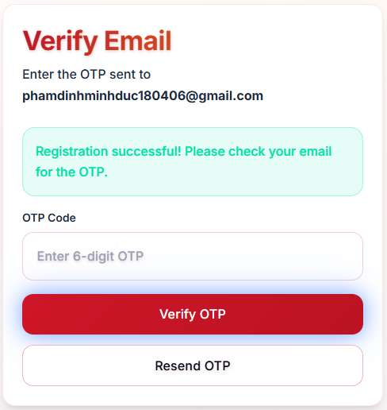

---

* **SEMO-REG-02: Hiển thị lỗi khi để trống trường bắt buộc**
    * **Tiền điều kiện:** Đang ở màn hình form Đăng ký.
    * **Các bước kiểm thử:**
        1. Để trống toàn bộ các ô nhập liệu (Email, Tên, Mật khẩu).
        2. Bấm trực tiếp vào nút **Đăng ký**.
    * **Kết quả mong đợi:** Hệ thống không gửi dữ liệu đi. Giao diện hiển thị các dòng cảnh báo lỗi bằng chữ màu đỏ hoặc viền đỏ ngay dưới các ô trống yêu cầu người dùng phải nhập thông tin.
      * **Hình ảnh minh chứng thực tế:**

        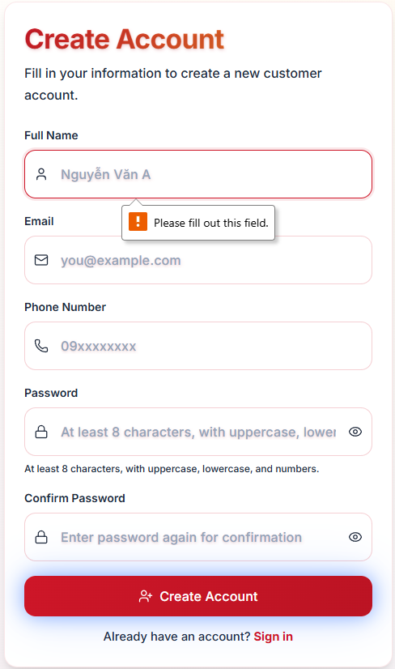

---

* **SEMO-REG-03: Hiển thị lỗi khi nhập sai định dạng Email**
    * **Tiền điều kiện:** Đang ở màn hình form Đăng ký.
    * **Các bước kiểm thử:**
        1. Tại ô Email, cố tình nhập một chuỗi không có ký tự `@` (Ví dụ: `ducminh123`).
        2. Điền đầy đủ Họ tên và Mật khẩu đúng quy chuẩn.
        3. Bấm nút **Đăng ký**.
    * **Kết quả mong đợi:** Giao diện lập tức chặn lại và hiển thị thông báo lỗi rõ ràng: "Email không đúng định dạng" hoặc "Vui lòng nhập một email hợp lệ".

      * **Hình ảnh minh chứng thực tế:**

        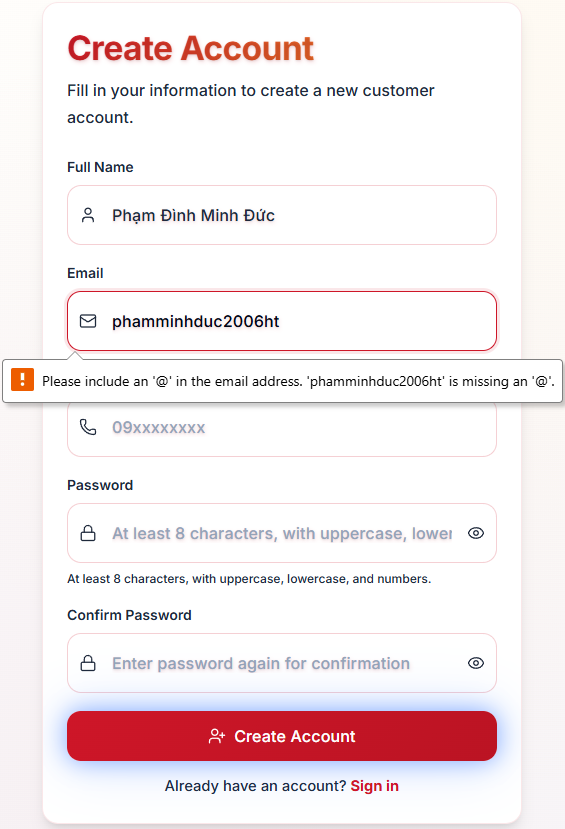

---

* **SEMO-REG-04: Hiển thị lỗi khi Mật khẩu quá ngắn**
    * **Tiền điều kiện:** Đang ở màn hình form Đăng ký.
    * **Các bước kiểm thử:**
        1. Nhập Email đúng định dạng và điền Họ tên đầy đủ.
        2. Tại ô Mật khẩu, nhập một chuỗi ký tự quá ngắn (Ví dụ: `123`).
        3. Bấm nút **Đăng ký**.
    * **Kết quả mong đợi:** Hệ thống đưa ra cảnh báo lỗi trực quan: "Mật khẩu phải chứa ít nhất 6 ký tự" để đảm bảo an toàn bảo mật.
      * **Hình ảnh minh chứng thực tế:**
  
        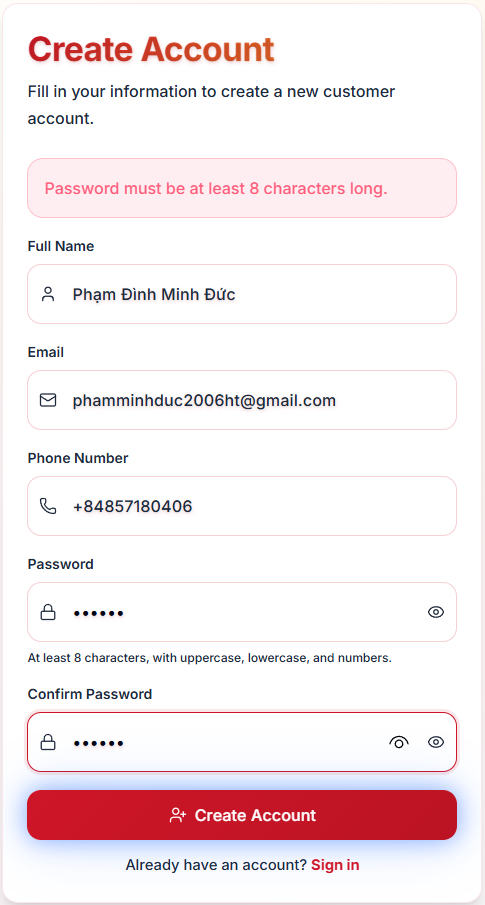

---

* **SEMO-REG-05: Hiển thị lỗi khi Số điện thoại không phải là 10 chữ số**
    * **Tiền điều kiện:** Đang ở màn hình form Đăng ký.
    * **Các bước kiểm thử:**
        1. Nhập Email đúng định dạng và điền Họ tên đầy đủ.
        2. Tại ô Số điện thoại, nhập một chuỗi không phải là 10 chữ số (Ví dụ: `12345`).
        3. Bấm nút **Đăng ký**.
    * **Kết quả mong đợi:** Hệ thống đưa ra cảnh báo lỗi trực quan: "Số điện thoại phải chứa đúng 10 chữ số" để đảm bảo an toàn bảo mật.
      * **Hình ảnh minh chứng thực tế:**

        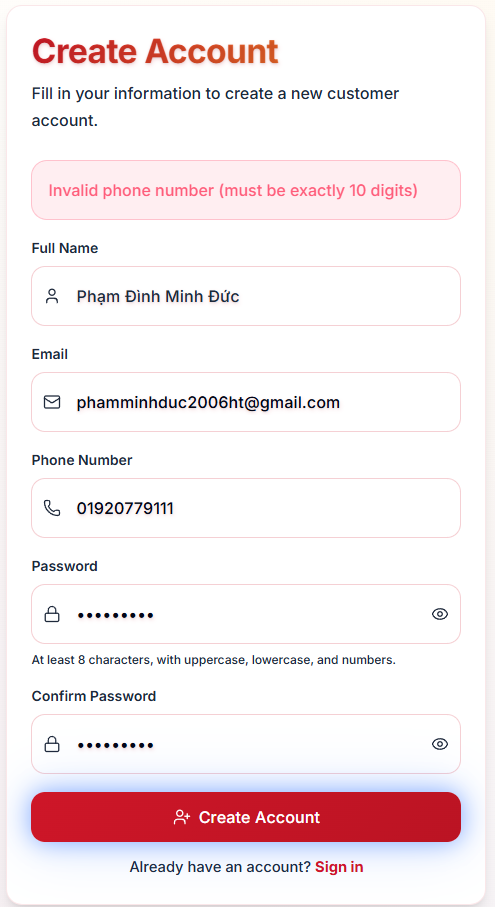

---

* **SEMO-REG-06: Hiển thị lỗi khi Nhập lại Mật khẩu không khớp**
    * **Tiền điều kiện:** Đang ở màn hình form Đăng ký.
    * **Các bước kiểm thử:**
        1. Nhập Email đúng định dạng và điền Họ tên đầy đủ.
        2. Tại ô Mật khẩu, nhập một chuỗi ký tự hợp lệ (từ 8 ký tự trở lên).
        3. Tại ô Nhập lại Mật khẩu, nhập một chuỗi khác với ô Mật khẩu.
        4. Bấm nút **Đăng ký**.
    * **Kết quả mong đợi:** Hệ thống đưa ra cảnh báo lỗi trực quan: "Mật khẩu không khớp" để đảm bảo an toàn bảo mật.
      * **Hình ảnh minh chứng thực tế:**

        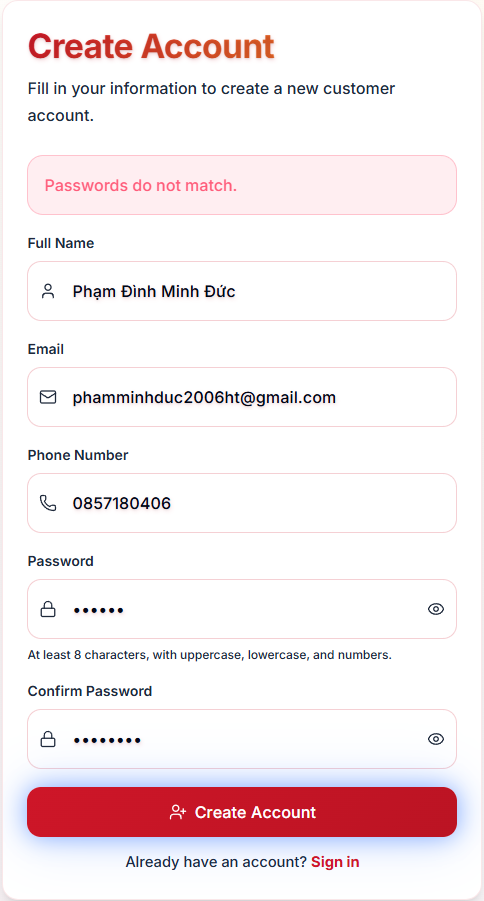

---

* **SEMO-REG-07: Hiển thị lỗi khi Mật khẩu không đúng với định dạng yêu cầu**
    * **Tiền điều kiện:** Đang ở màn hình form Đăng ký.
    * **Các bước kiểm thử:**
        1. Nhập Email đúng định dạng và điền Họ tên đầy đủ.
        2. Tại ô Mật khẩu, nhập một chuỗi ký tự không đúng định dạng (ví dụ: chỉ chứa ký tự đặc biệt).
        3. Tại ô Nhập lại Mật khẩu, nhập cùng chuỗi ký tự với ô Mật khẩu.
        4. Bấm nút **Đăng ký**.
    * **Kết quả mong đợi:** Hệ thống đưa ra cảnh báo lỗi trực quan: "Mật khẩu phải chứa ít nhất 8 ký tự, bao gồm chữ hoa, chữ thường, số và ký tự đặc biệt" để đảm bảo an toàn bảo mật.
      * **Hình ảnh minh chứng thực tế:**

        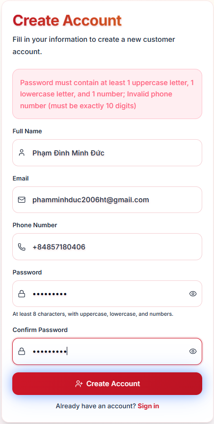

---

* **SEMO-REG-08: Hiển thị lỗi khi Email nhập trùng với Email đã tồn tại**
    * **Tiền điều kiện:** Đang ở màn hình form Đăng ký.
    * **Các bước kiểm thử:**
        1. Nhập Email đúng định dạng và điền Họ tên đầy đủ.
        2. Tại ô Mật khẩu, nhập một chuỗi ký tự hợp lệ (từ 8 ký tự trở lên).
        3. Tại ô Nhập lại Mật khẩu, nhập cùng chuỗi ký tự với ô Mật khẩu.
        4. Tại ô Email, nhập một địa chỉ Email đã tồn tại trên hệ thống
        5. Bấm nút **Đăng ký**.
    * **Kết quả mong đợi:** Hệ thống đưa ra cảnh báo lỗi trực quan: "Email đã tồn tại" để đảm bảo an toàn bảo mật.
      * **Hình ảnh minh chứng thực tế:**

        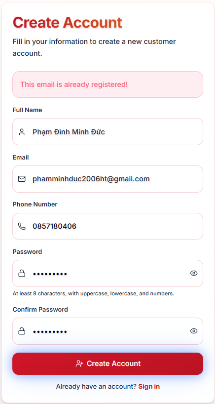

---
#### 1.6.2. Chức năng Đăng nhập (Login)

* **SEMO-LOG-01: Đăng nhập thành công với quyền Khách hàng (User)**
    * **Tiền điều kiện:** Đã có tài khoản User thường được kích hoạt thành công trên hệ thống.
    * **Các bước kiểm thử:**
        1. Truy cập vào trang Đăng nhập.
        2. Nhập chính xác Email và Mật khẩu của tài khoản User.
        3. Bấm nút **Đăng nhập** (Login).
    * **Kết quả mong đợi:** Đăng nhập thành công, hệ thống điều hướng người dùng mượt mà vào giao diện Dashboard chính (nơi hiển thị bản đồ tìm kiếm vị trí các xe scooter).
      * **Hình ảnh minh chứng thực tế:**
      
        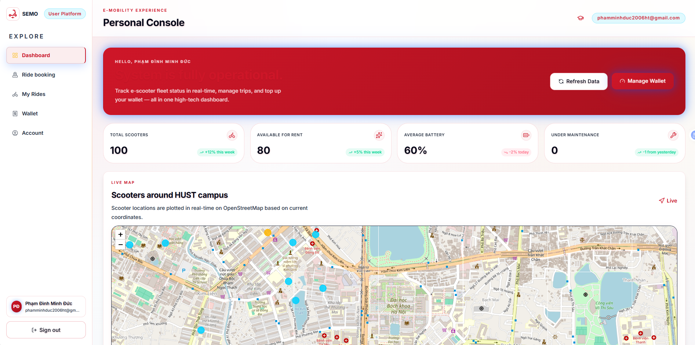

---

* **SEMO-LOG-02: Đăng nhập thành công với quyền Quản trị viên (Admin)**
    * **Tiền điều kiện:** Có thông tin tài khoản được phân quyền Admin cấp hệ thống.
    * **Các bước kiểm thử:**
        1. Truy cập vào trang Đăng nhập.
        2. Nhập chính xác Email và Mật khẩu của tài khoản Admin.
        3. Bấm nút **Đăng nhập**.
    * **Kết quả mong đợi:** Hệ thống nhận diện đúng quyền hạn, điều hướng Admin thẳng vào màn hình chức năng quản trị đặc thù (`/admin/scooters`).
      * **Hình ảnh minh chứng thực tế:**

        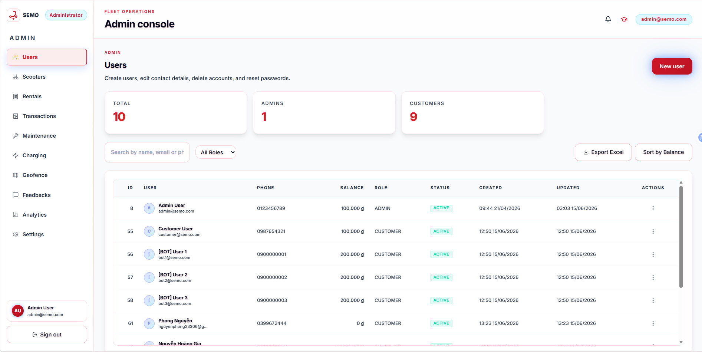

---

* **SEMO-LOG-03: Hiển thị lỗi khi nhập sai Mật khẩu**
    * **Tiền điều kiện:** Tài khoản kiểm thử đã tồn tại trên hệ thống.
    * **Các bước kiểm thử:**
        1. Nhập đúng địa chỉ Email của tài khoản.
        2. Cố tình gõ sai chuỗi ký tự mật khẩu.
        3. Bấm nút **Đăng nhập**.
    * **Kết quả mong đợi:** Trang web không bị treo, hiển thị dòng thông báo lỗi trực quan: "Tài khoản hoặc mật khẩu không chính xác".
      * **Hình ảnh minh chứng thực tế:**

        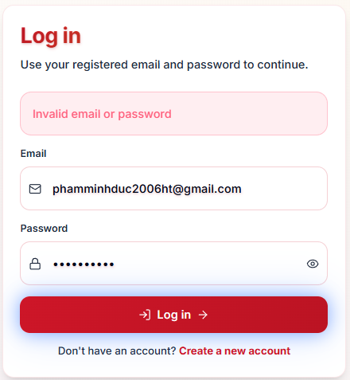

---

* **SEMO-LOG-04: Hiển thị lỗi khi để trống trường bắt buộc**
    * **Tiền điều kiện:** Tài khoản kiểm thử đã tồn tại trên hệ thống.
    * **Các bước kiểm thử:**
        1. Để trống toàn bộ các ô nhập liệu (Email, Mật khẩu).
        2. Bấm trực tiếp vào nút **Đăng nhập**.
  * **Kết quả mong đợi:** Hệ thống không gửi dữ liệu đi. Giao diện hiển thị các dòng cảnh báo lỗi bằng chữ màu đỏ hoặc viền đỏ ngay dưới các ô trống yêu cầu người dùng phải nhập thông tin.
    * **Hình ảnh minh chứng thực tế:**

      .png)

---
#### 1.6.3. Chức năng Quản lý xe Scooter (Scooter Management - Quyền Admin)

* **SEMO-SCO-01: Kiểm tra hiển thị danh sách xe đầy đủ**
    * **Tiền điều kiện:** Đã đăng nhập bằng tài khoản quản trị Admin và điều hướng tới mục Quản lý xe.
    * **Các bước kiểm thử:**
        1. Di chuyển đến menu điều hướng **Quản lý xe** (Scooters Page).
        2. Quan sát bảng hiển thị danh sách xe trên màn hình giao diện.
    * **Kết quả mong đợi:** Bảng dữ liệu tải ổn định, hiển thị rõ ràng và chính xác các cột thông tin bắt buộc: Mã định danh xe (Scooter ID), Lượng Pin (%), Trạng thái hoạt động (Available / Maintenance / In Use), và Tọa độ Vị trí (Kinh độ/Vĩ độ).
      * **Hình ảnh minh chứng thực tế:**
  
        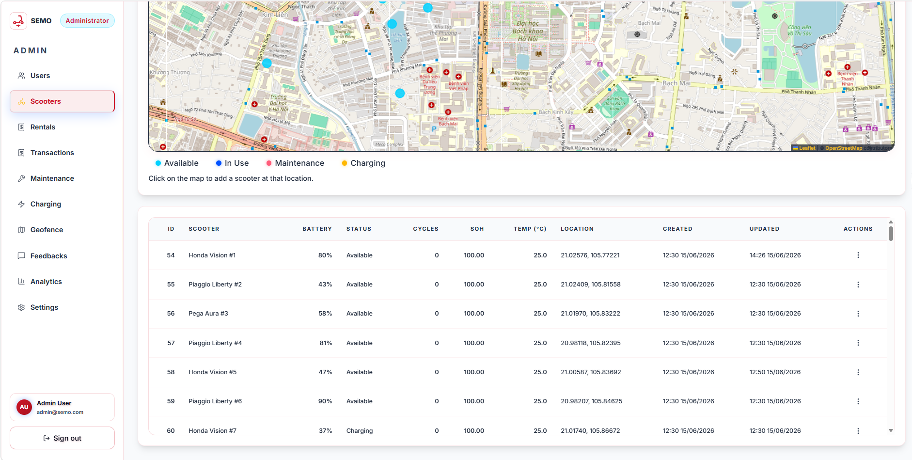

---

* **SEMO-SCO-02: Thêm mới xe Scooter thành công với thông tin hợp lệ**
    * **Tiền điều kiện:** Đang ở giao diện trang quản lý xe của Admin và database đã được reset sạch dữ liệu.
    * **Các bước kiểm thử:**
        1. Nhấn vào nút **Thêm mới xe** (Add Scooter) để kích hoạt mở form nhập liệu.
        2. Nhập mã xe không trùng lặp (Ví dụ: `Honda Vision #101`).
        3. Nhập lượng Pin khởi tạo hợp lệ (Ví dụ: `23`).
        4. Nhập tọa độ Kinh độ (Longitude) và Vĩ độ (Latitude) hợp lệ (Ví dụ: Vĩ độ: `21.00343`, Kinh độ: `105.85000`).
        5. Bấm nút **Lưu** (Save) hoặc **Xác nhận**.
    * **Kết quả mong đợi:** Form thêm xe đóng lại thành công, hệ thống hiển thị thông báo "Thêm xe thành công". Chiếc xe mới với mã `Honda Vision #101` xuất hiện ngay lập tức trên bảng danh sách dữ liệu.
      * **Hình ảnh minh chứng thực tế:**
  
        .png)
  
        .png)
    

---

* **SEMO-SCO-03: Hiển thị lỗi khi thêm xe bỏ trống các trường bắt buộc**
    * **Tiền điều kiện:** Đang mở form thêm mới xe Scooter.
    * **Các bước kiểm thử:**
        1. Để trống toàn bộ các trường dữ liệu trên form (Mã xe, Pin, Tọa độ).
        2. Bấm trực tiếp vào nút **Lưu**.
    * **Kết quả mong đợi:** Hệ thống chặn lại không gửi request lỗi lên server. Giao diện hiển thị các cảnh báo đỏ yêu cầu nhập đầy đủ thông tin bắt buộc ngay tại các ô nhập tương ứng.
      * **Hình ảnh minh chứng thực tế:**

        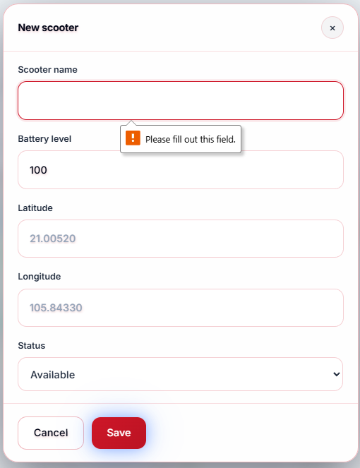

---

* **SEMO-SCO-04: Hiển thị lỗi khi thêm xe với lượng Pin không hợp lệ (Nhỏ hơn 0% hoặc Lớn hơn 100%)**
    * **Tiền điều kiện:** Đang mở form thêm mới xe Scooter.
    * **Các bước kiểm thử:**
        1. Nhập Mã xe và Tọa độ vị trí hợp lệ.
        2. Tại ô nhập Lượng Pin (%), cố tình nhập một giá trị vô lý nằm ngoài khoảng 0-100 (Ví dụ: Nhập `-10` hoặc `120`).
        3. Bấm nút **Lưu**.
    * **Kết quả mong đợi:** Hệ thống từ chối lưu dữ liệu rác, hiển thị cảnh báo trực quan: "Dung lượng pin phải nằm trong khoảng từ 0 đến 100%".
      * **Hình ảnh minh chứng thực tế:**
  
        .png)

        .png)

---

* **SEMO-SCO-05: Hiển thị lỗi khi thêm xe với Tọa độ sai định dạng (Vĩ độ/Kinh độ không hợp lệ)**
    * **Tiền điều kiện:** Đang mở form thêm mới xe Scooter.
    * **Các bước kiểm thử:**
        1. Nhập Mã xe và Pin hợp lệ.
        2. Tại ô nhập Vĩ độ (Latitude) hoặc Kinh độ (Longitude), cố tình nhập chuỗi văn bản/ký tự đặc biệt thay vì nhập số định dạng thập phân (Ví dụ Vĩ độ nhập: `hanoi_hust`).
        3. Bấm nút **Lưu**.
    * **Kết quả mong đợi:** Hệ thống báo lỗi định dạng dữ liệu đầu vào ngay tại trường tọa độ, không cho phép gửi request lỗi lên backend.
      * **Hình ảnh minh chứng thực tế:**
  
        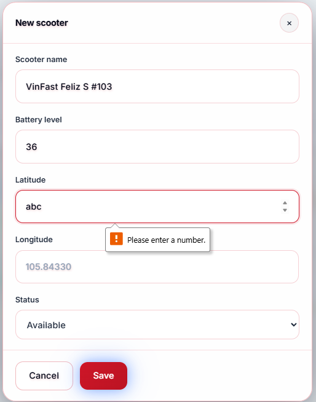

---

* **SEMO-SCO-06: Hiển thị lỗi khi tạo trùng Mã xe đã tồn tại trên hệ thống**
    * **Tiền điều kiện:** Xe có mã `SCO-2026` đã được tạo thành công từ trước.
    * **Các bước kiểm thử:**
        1. Mở form thêm mới xe.
        2. Tại ô Mã xe, nhập chính xác mã trùng lặp: `SCO-2026`.
        3. Nhập đầy đủ Pin và Tọa độ hợp lệ.
        4. Bấm nút **Lưu**.
    * **Kết quả mong đợi:** Backend nhận diện mã định danh duy nhất bị trùng, trả lỗi về giao diện; hệ thống hiển thị thông báo cảnh báo: "Mã xe đã tồn tại trên hệ thống, vui lòng kiểm tra lại".
      * **Hình ảnh minh chứng thực tế:**
  
        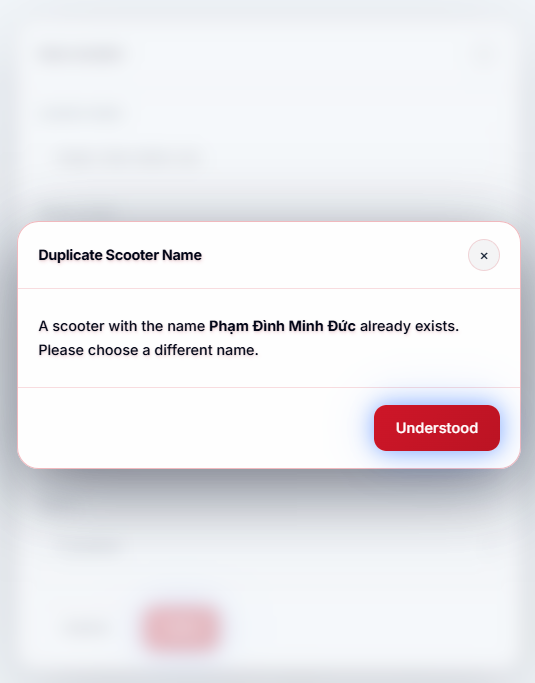

---

* **SEMO-SCO-07: Cập nhật thành công thông tin và Trạng thái hoạt động của xe**
    * **Tiền điều kiện:** Đã có ít nhất một chiếc xe hiển thị trong danh sách quản trị của Admin.
    * **Các bước kiểm thử:**
        1. Tìm đến chiếc xe cần chỉnh sửa, bấm vào biểu tượng hoặc nút **Chỉnh sửa** (Edit).
        2. Tiến hành thay đổi Trạng thái hoạt động từ "Sẵn sàng" (Available) sang "Đang bảo trì" (Maintenance).
        3. Thử thay đổi cập nhật lại chỉ số Pin hoặc Tọa độ mới.
        4. Bấm nút **Cập nhật** (Update) hoặc **Lưu**.
    * **Kết quả mong đợi:** Hệ thống hiển thị thông báo cập nhật thành công, form chỉnh sửa đóng lại và thông tin trạng thái mới của xe lập tức được đổi màu/hiển thị chính xác trên bảng danh sách.
      * **Hình ảnh minh chứng thực tế:**
  
        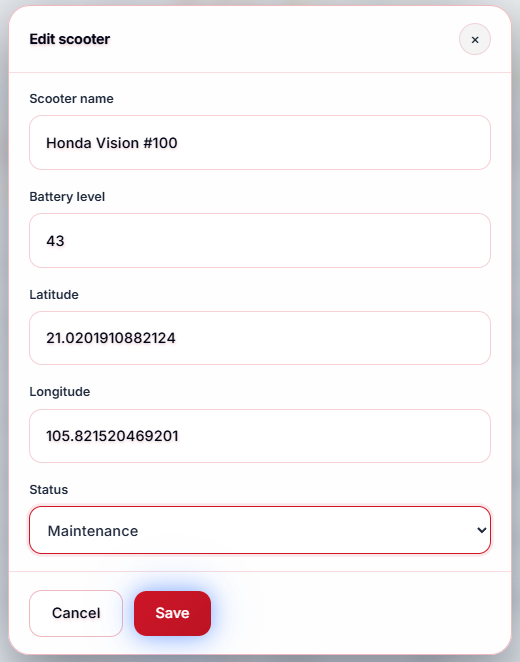

---

* **SEMO-SCO-08: Xóa xe Scooter ra khỏi danh sách quản lý hệ thống**
    * **Tiền điều kiện:** Có chiếc xe cần xóa hiển thị trên bảng quản trị Admin.
    * **Các bước kiểm thử:**
        1. Tìm đến chiếc xe cần xóa, bấm vào nút hành động **Xóa** (Delete).
        2. Quan sát xem hệ thống có hiển thị thông báo xác nhận hay không (Ví dụ: "Bạn có chắc chắn muốn xóa xe này không?").
        3. Bấm **Xác nhận xóa** (Confirm).
    * **Kết quả mong đợi:** Hệ thống xóa thành công bản ghi, đưa ra thông báo xác nhận và chiếc xe đó lập tức biến mất hoàn toàn khỏi bảng danh sách hiển thị của Admin.
      * **Hình ảnh minh chứng thực tế:**
  
        

---

* **SEMO-SCO-09: Kiểm tra hiển thị danh sách và bộ lọc lịch sử thuê xe**
    * **Tiền điều kiện:** Đã đăng nhập tài khoản Admin, truy cập menu **Rentals**.
    * **Các bước kiểm thử:**
        1. Quan sát bảng hiển thị danh sách các lượt thuê xe trên hệ thống.
        2. Click thử qua các tab bộ lọc: **ALL**, **IN_USE**, và **COMPLETED**.
    * **Kết quả mong đợi:** Bảng hiển thị chính xác ID chuyến đi, Tên người dùng (User), Mã số xe (Scooter ID), Trạng thái (Status), Thời gian bắt đầu/kết thúc (Start/End) và Tổng tiền (Price). Các tab bộ lọc hoạt động mượt mà, phân loại đúng danh sách xe đang chạy hoặc đã hoàn thành.
      * **Hình ảnh minh chứng thực tế:**
  
        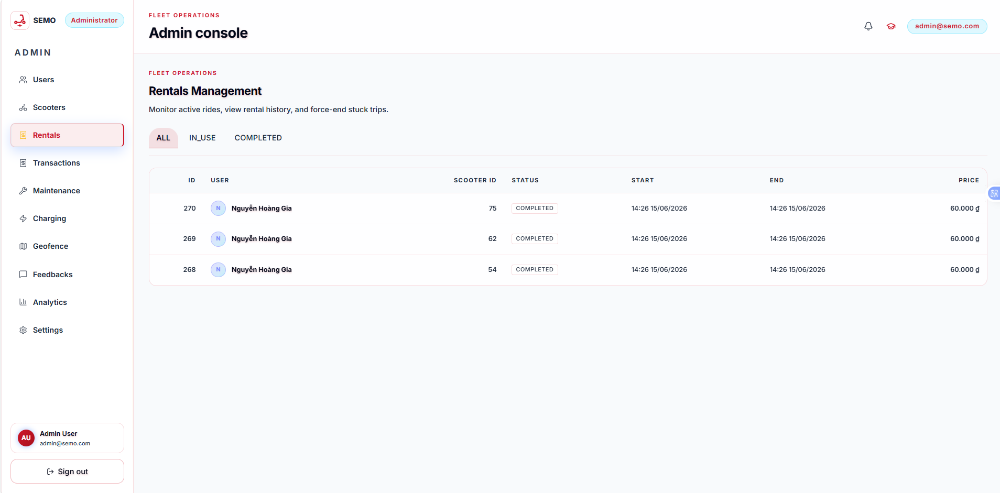

---

* **SEMO-SCO-10: Phê duyệt hoặc từ chối yêu cầu nạp tiền (Deposit) của người dùng**
    * **Tiền điều kiện:** Có lệnh nạp tiền của User đang ở trạng thái chờ duyệt (`PENDING`).
    * **Các bước kiểm thử:**
        1. Truy cập menu **Transactions**, tìm đến giao dịch có nhãn trạng thái `PENDING` màu vàng.
        2. Thao tác click vào biểu tượng **Duyệt (Tích xanh)** hoặc **Từ chối (Dấu X đỏ)** ở cột ACTIONS.
    * **Kết quả mong đợi:** Khi bấm Duyệt hoặc Từ chối, hệ thống phải cập nhật lập tức trạng thái giao dịch thành `COMPLETED` hoặc `REJECTED`, đồng thời số dư ví của User tương ứng phải được cộng tiền (hoặc giữ nguyên nếu từ chối) trên Cloud Database.
      * **Hình ảnh minh chứng thực tế:**
  
        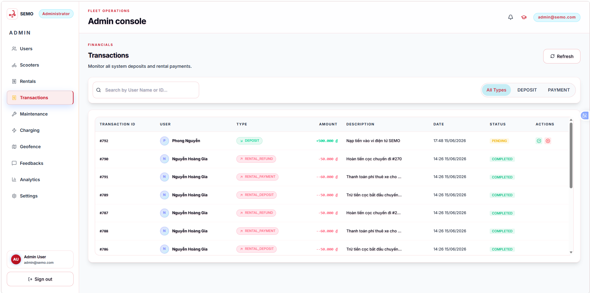

---

* **SEMO-SCO-11: Xử lý trạng thái xe hỏng và ghi nhận lịch sử sửa chữa**
    * **Tiền điều kiện:** Có xe trong danh sách đang ở trạng thái `MAINTENANCE`.
    * **Các bước kiểm thử:**
        1. Truy cập menu **Maintenance**.
        2. Bấm vào biểu tượng dấu ba chấm dọc ở cuối dòng của xe lỗi, chọn **Resolve** (Xử lý xong) hoặc **Add Log** (Thêm nhật ký sửa chữa).
        3. Thử bấm nút **Resolve All** ở góc trên bên phải giao diện.
    * **Kết quả mong đợi:** Hệ thống cho phép thêm log ghi nhận lỗi. Khi xác nhận `Resolve`, xe đó phải được đổi trạng thái thành công về `AVAILABLE` (Sẵn sàng) và biến mất khỏi tab lọc xe lỗi.
      * **Hình ảnh minh chứng thực tế:**
  
        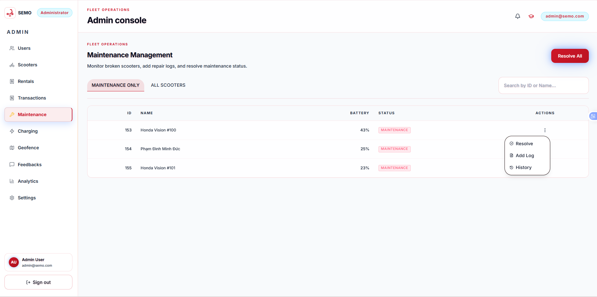

---

* **SEMO-SCO-12: Kiểm tra tính năng quét và kích hoạt sạc tự động**
    * **Tiền điều kiện:** Hệ thống có xe dưới ngưỡng pin quy định đang hiển thị trên bản đồ sạc.
    * **Các bước kiểm thử:**
        1. Truy cập menu **Charging**.
        2. Bấm nút **Auto-Schedule Charging** ở góc phải.
    * **Kết quả mong đợi:** Thuật toán hệ thống tự động quét toàn bộ xe pin yếu, chuyển trạng thái của chúng sang `CHARGING` và gom hiển thị xuống bảng danh sách chờ sạc phía dưới. Khi bấm nút **Complete** ở cột ACTIONS, xe phải được nạp đầy 100% pin.
      * **Hình ảnh minh chứng thực tế:**
  
        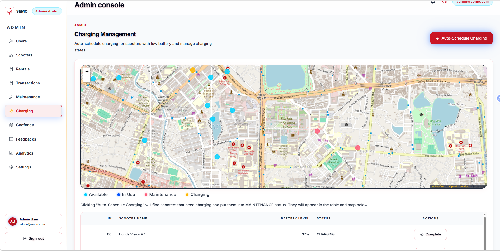

---

* **SEMO-SCO-13: Thiết lập vùng giới hạn di chuyển mới trên bản đồ**
    * **Tiền điều kiện:** Đang ở màn hình thiết lập Geofence.
    * **Các bước kiểm thử:**
        1. Truy cập menu **Geofence**.
        2. Bấm vào nút **New Zone**.
        3. Click bất kỳ một điểm nào trên bản đồ tương tác để lấy Tọa độ, nhập tên vùng (Ví dụ: `Quận Hai Bà Trưng`) và Bán kính giới hạn (Radius).
    * **Kết quả mong đợi:** Vùng giới hạn (hình tròn màu xanh lam) hiển thị trực quan bao phủ trên bản đồ. Dữ liệu vùng mới được lưu xuống danh sách quản lý phía dưới.
      * **Hình ảnh minh chứng thực tế:**
  
        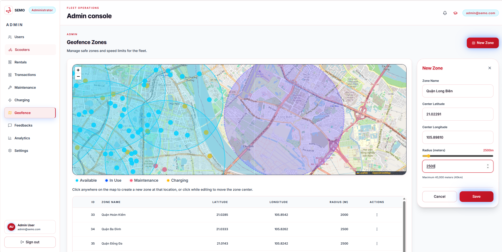

---

* **SEMO-SCO-14: Kiểm tra hiển thị danh sách phản hồi và chấm điểm số sao**
    * **Các bước kiểm thử:**
        1. Truy cập menu **Feedbacks**.
        2. Kiểm tra danh sách hiển thị các bình luận từ người dùng gửi về.
    * **Kết quả mong đợi:** Bảng dữ liệu hiển thị tường minh ID phản hồi, Tên User, Mã chuyến đi (Rental ID), Số sao đánh giá (Rating hiển thị bằng icon ngôi sao vàng) và nội dung bình luận (Comment).
      * **Hình ảnh minh chứng thực tế:**
  
        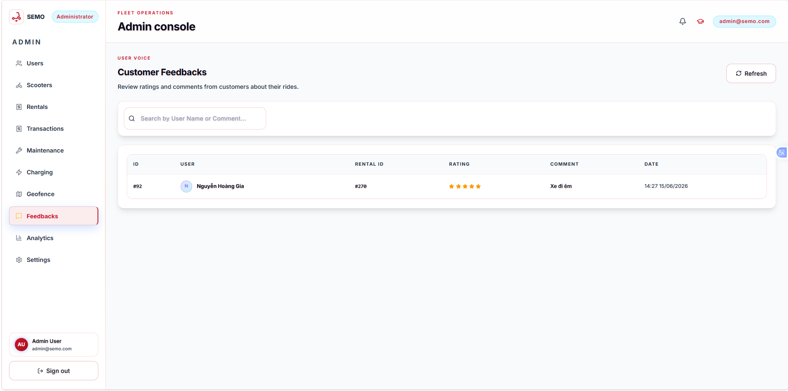

---

* **SEMO-SCO-15: Kiểm tra tính toán dữ liệu tổng hợp và chạy thuật toán phân nhóm trạm sạc tối ưu**
    * **Các bước kiểm thử:**
        1. Truy cập menu **Analytics**.
        2. Kiểm tra các chỉ số thống kê ở các ô: TOTAL REVENUE, TOTAL RIDES, FLEET AVAILABLE, MAINTENANCE COSTS.
        3. Tại mục AI INSIGHTS, chọn thuật toán **K-Means (Fixed K)**, nhập số lượng trạm sạc (`Number of stations (k) = 3`) rồi bấm nút **Calculate**.
    * **Kết quả mong đợi:** Các số liệu doanh thu và chuyến đi hiển thị chính xác. Sau khi bấm Calculate, hệ thống giả lập thuật toán phân cụm thành công và hiển thị các vị trí trạm sạc tối ưu (các chấm màu) ngay trên bản đồ phía dưới.
      * **Hình ảnh minh chứng thực tế:**
  
        .png)
  
        .png)

---

* **SEMO-SCO-16: Thay đổi các tham số tính phí và ngưỡng vận hành hệ thống**
    * **Các bước kiểm thử:**
        1. Truy cập menu **Settings**.
        2. Chọn một cấu hình cần sửa (Ví dụ: giá thuê mỗi phút `BASE_PRICE` hoặc số dư tối thiểu `MIN_BALANCE`), bấm dấu ba chấm dọc chọn **Edit**.
        3. Nhập giá trị mới và bấm Lưu.
    * **Kết quả mong đợi:** Giá trị tham số mới được áp dụng toàn cục lên hệ thống, bắt buộc mọi lượt tính tiền hoặc điều phối xe của toàn bộ User/Admin sau đó phải áp dụng theo cấu hình mới này.
      * **Hình ảnh minh chứng thực tế:**
  
        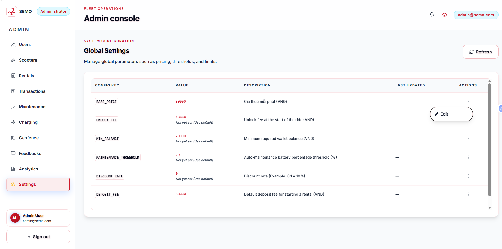

---

#### 1.6.4. Chức năng dành cho Khách hàng (User Giao diện & Trải nghiệm)

* **SEMO-USR-01: Kiểm tra giao diện Tổng quan hệ thống (Dashboard)**
    * **Tiền điều kiện:** Đã đăng nhập bằng tài khoản Khách hàng (User Platform).
    * **Các bước kiểm thử:**
        1. Truy cập menu **Dashboard**.
        2. Kiểm tra hiển thị tên người dùng và các khối số liệu: TOTAL SCOOTERS, AVAILABLE FOR RENT, AVERAGE BATTERY, UNDER MAINTENANCE.
        3. Quan sát bản đồ trực quan (Live Map) và danh sách xe cập nhật mới nhất (Latest Updates) phía dưới.
    * **Kết quả mong đợi:** Giao diện hiển thị đúng lời chào (vd: "HELLO, PHẠM ĐÌNH MINH ĐỨC"). Các số liệu tổng hợp xe và phần trăm pin tải chính xác dữ liệu từ cơ sở dữ liệu. Bản đồ hiển thị đúng các chấm định vị xe theo mã màu (Available, In Use, Maintenance, Charging). Bảng danh sách hiển thị rõ ràng trạng thái và mức pin của từng xe (vd: Honda Vision #101 - Under Maintenance - 23%).
      * **Hình ảnh minh chứng thực tế:**
  
        .png)

        .png)

---

* **SEMO-USR-02: Tìm kiếm xe và lọc theo trạng thái/bán kính (Ride booking)**
    * **Tiền điều kiện:** Đang ở màn hình đặt xe.
    * **Các bước kiểm thử:**
        1. Truy cập menu **Ride booking**.
        2. Thử gõ tìm kiếm xe tại ô "Search by name / ID...".
        3. Chọn bộ lọc "All Status" và kéo thanh trượt bán kính "Radius: 1.5 km".
    * **Kết quả mong đợi:** Bản đồ tải đầy đủ các nhãn tên xe (vd: Super Soco CUx #51, Dat Bike Weaver #58). Danh sách xe bên phải hiển thị đúng khoảng cách tương ứng (vd: 217 m) và trạng thái khả dụng của xe. Thanh kéo bán kính hoạt động mượt mà và lọc đúng vị trí xe trong phạm vi lựa chọn.
      * **Hình ảnh minh chứng thực tế:**
  
        .png)
  
        .png)

---

* **SEMO-USR-03: Thực hiện quy trình Đặt xe, Mở khóa và Báo cáo sự cố (Booking Flow)**
    * **Tiền điều kiện:** Chọn một xe bất kỳ đang ở trạng thái `AVAILABLE` trên bản đồ (vd: Super Soco CUx #10).
    * **Các bước kiểm thử:**
        1. Click vào chấm xe trên bản đồ để hiện bảng thông tin phụ (Status, Battery, Distance).
        2. Thao tác bấm lần lượt các nút trong bảng tiến trình bên phải: **Book**, **Unlock**, **Start**, và **End**.
        3. Kiểm tra tính năng báo cáo lỗi nhanh bằng cách bấm vào các nút trong mục **REPORT ISSUE** (vd: *Battery overheating*, *Rapid battery drain*).
    * **Kết quả mong đợi:** Nút tiến trình hoạt động theo đúng logic luồng đi (Phải bấm Book xong mới sáng nút Unlock, v.v.). Khi bấm "Cancel Booking" hoặc "End", hệ thống kết thúc chuyến đi chính xác. Các nút báo cáo sự cố phản hồi nhanh, gửi thông tin lỗi của xe về cho hệ thống Admin xử lý.
      * **Hình ảnh minh chứng thực tế:**
  
        .png)

        .png)

---

* **SEMO-USR-04: Kiểm tra màn hình Lịch sử chuyến đi (My Rides)**
    * **Tiền điều kiện:** Tài khoản User đã thưc hiện một chuyến đi hoàn thành (COMPLETED) hoặc chưa thực hiện chuyến đi nào trong hệ thống.
    * **Các bước kiểm thử:**
        1. Truy cập menu **My Rides**.
        2. Quan sát hai khối hiển thị: TOTAL COMPLETED RIDES và TOTAL SPENT.
    * **Kết quả mong đợi:** Nếu User đã có chuyến đi hoàn thành, hệ thống hiển thị chính xác tổng số chuyến đi và tổng tiền đã chi tiêu (vd: 1 ride - 15.000 đ). Nếu chưa có chuyến đi nào, cả hai khối số liệu phải hiển thị `0` rõ ràng.
      * **Hình ảnh minh chứng thực tế:**
  
        .png)

        .png)

---

* **SEMO-USR-05: Kiểm tra chức năng Gửi đánh giá chuyến đi (Rate Your Ride) -**
    * **Tiền điều kiện:** Chuyến đi đã kết thúc và hiển thị trong danh sách "Recent Trips" tại menu My Rides.
    * **Các bước kiểm thử:**
        1. Truy cập menu **My Rides**, tìm đến chuyến đi vừa hoàn thành (ví dụ: `Rental ID: #273`).
        2. Thao tác bấm vào nút **Feedback** trên thẻ thông tin chuyến đi.
        3. Quan sát sự xuất hiện của hộp thoại Popup "Rate Your Ride".
        4. Thử click chọn mức số sao (chọn từ 1 đến 5 sao).
        5. Nhập nội dung văn bản vào ô "Tell us what you liked or what could be better...".
        6. Bấm nút **Submit Feedback** để gửi, hoặc nút **Cancel** (hoặc dấu **X**) để hủy bỏ.
    * **Kết quả mong đợi:** Khối số liệu tổng hợp cập nhật chính xác (ví dụ: `TOTAL SPENT: 60.000 đ`). Khi bấm nút Feedback, hộp thoại hiển thị mượt mà, ghi nhận đúng mã chuyến đi (`Rental #273`). Giao diện tương tác chọn số sao hoạt động nhạy. Khi bấm "Submit Feedback", dữ liệu được gửi thành công về hệ thống và hiển thị thông báo xác nhận; popup tự động đóng lại.
      * **Hình ảnh minh chứng thực tế:**

        .png)

        .png)

---

* **SEMO-USR-06: Hiển thị lỗi khi để trống số tiền nạp**
    * **Tiền điều kiện:** Đã đăng nhập tài khoản User, truy cập menu **Wallet**. Số dư hiện tại hiển thị đúng thực tế (Ví dụ: `22.080.000 đ`).
    * **Các bước kiểm thử:**
        1. Để trống hoàn toàn ô nhập dữ liệu "Deposit Amount (VND)".
        2. Bấm trực tiếp vào nút **+ Confirm Top Up** hoặc nút **Show QR Code**.
    * **Kết quả mong đợi:** Hệ thống chặn không gửi lệnh đi, giao diện lập tức xuất hiện thông báo lỗi hệ thống ngay tại ô nhập liệu: "Please fill out this field." để nhắc nhở người dùng nhập số tiền.
      * **Hình ảnh minh chứng thực tế:**
  
        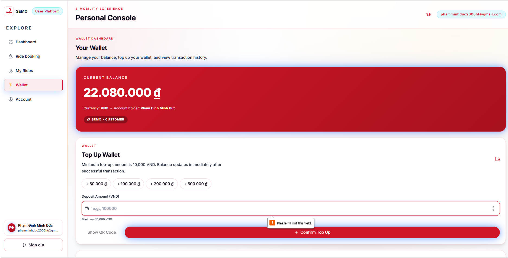

---

* **SEMO-USR-07: Hiển thị lỗi khi nhập số tiền nhỏ hơn mức tối thiểu (Dưới 10.000 VND)**
    * **Tiền điều kiện:** Đang ở màn hình menu Wallet.
    * **Các bước kiểm thử:**
        1. Tại ô "Deposit Amount (VND)", cố tình gõ vào một số tiền nhỏ hơn mức tối thiểu 10.000đ (Ví dụ nhập: `1000`).
        2. Bấm nút **+ Confirm Top Up** hoặc **Show QR Code**.
    * **Kết quả mong đợi:** Hệ thống nhận diện số tiền không đủ điều kiện tối thiểu. Giao diện chặn lại và hiển thị cảnh báo validation trực quan ngay tại ô nhập: "Value must be greater than or equal to 10000.".
      * **Hình ảnh minh chứng thực tế:**
  
        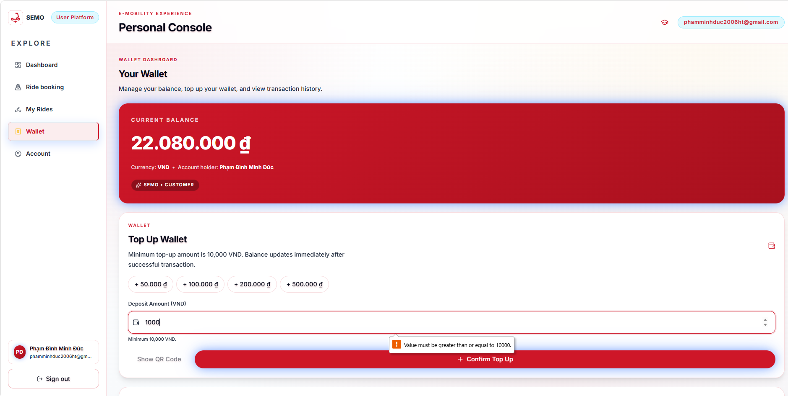

---

* **SEMO-USR-08: Xác nhận thông tin dòng mô tả khi nhập số tiền hợp lệ**
    * **Tiền điều kiện:** Đang ở màn hình menu Wallet.
    * **Các bước kiểm thử:**
        1. Nhập một số tiền nạp hợp lệ lớn hơn hoặc bằng 10.000đ vào ô trống (Ví dụ nhập: `100000`).
        2. Hoặc bấm vào các nút chọn nhanh số tiền có sẵn (`+ 50.000 đ`, `+ 100.000 đ`,...).
    * **Kết quả mong đợi:** Hệ thống tự động kiểm tra tính hợp lệ của dữ liệu. Ngay dưới ô nhập xuất hiện một dòng chữ mô tả ngắn màu xám để người dùng xác nhận lại: "Will deposit 100.000 đ into your wallet.". Các cảnh báo đỏ hoặc thông báo lỗi trước đó biến mất.
      * **Hình ảnh minh chứng thực tế:**
  
        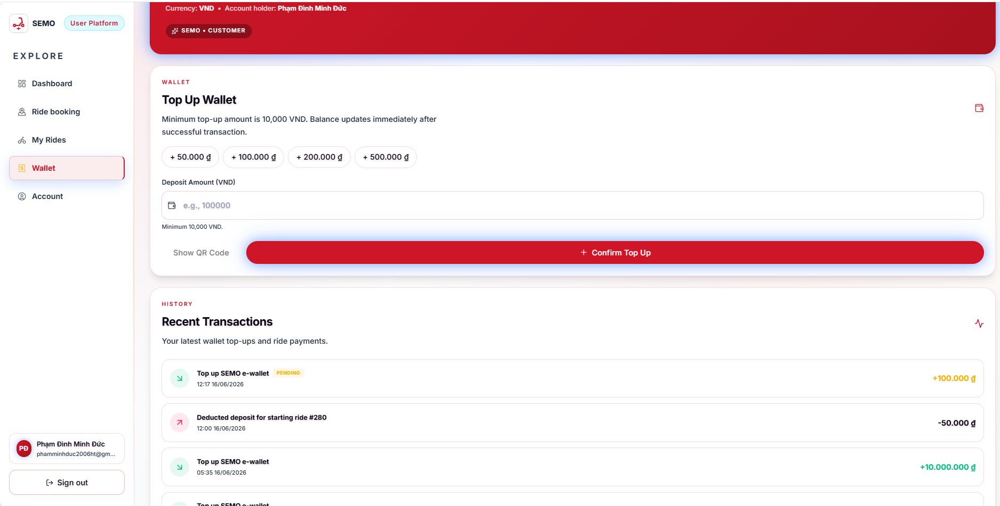

---

* **SEMO-USR-09: Hiển thị Mã VietQR động ứng với số tiền nạp**
    * **Tiền điều kiện:** Đã nhập số tiền hợp lệ ở bước trước (Ví dụ: `100000`) và nhấn nút hiển thị mã QR.
    * **Các bước kiểm thử:**
        1. Quan sát sự xuất hiện của hộp thoại Popup "Quick Transfer via QR Code" hiển thị đè lên màn hình chính.
        2. Kiểm tra tính chính xác của thông tin nạp tiền bao gồm: Tên tài khoản hiển thị (`SEMO APP`), Số tài khoản ngân hàng (`0399672303`), Ngân hàng đối tác (`Napas247 | MB`), và số tiền hiển thị trên dòng thông tin (`Số tiền: 100.000 VND`).
        3. Thử bấm nút **Close** màu đỏ hoặc biểu tượng chữ **X** để đóng popup.
    * **Kết quả mong đợi:** Hộp thoại popup hiển thị rõ ràng, sắc nét. Số tiền trên mã VietQR động phải trùng khớp chính xác với số tiền người dùng đã nhập ở ô form ngoài. Khi bấm Close hoặc dấu X, popup đóng lại ngay lập tức và đưa người dùng quay về màn hình ví để hoàn tất giao dịch.
      * **Hình ảnh minh chứng thực tế:**
  
        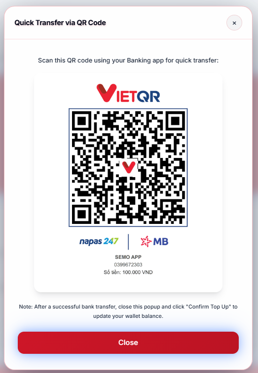
  
---

* **SEMO-USR-10: Kiểm tra chức năng Cập nhật thông tin cá nhân (Personal Information)**
    * **Tiền điều kiện:** Đã đăng nhập tài khoản User và truy cập vào menu Account.
    * **Các bước kiểm thử:**
        1. Tại mục *Personal Information*, thử thay đổi nội dung trong ô "Full Name" hoặc "Email Address".
        2. Bỏ trống ô "Enter current password" ở vùng *Confirm Password to Save*.
        3. Nhấn vào nút **Save Profile Changes** ở dưới cùng.
    * **Kết quả mong đợi:** Hệ thống không cho phép lưu thay đổi. Ô nhập mật khẩu hiện tại hiển thị cảnh báo bắt buộc điền thông tin vì đây là điều kiện bảo mật bắt buộc để xác minh danh tính trước khi cập nhật hồ sơ.
      * **Hình ảnh minh chứng thực tế:**

        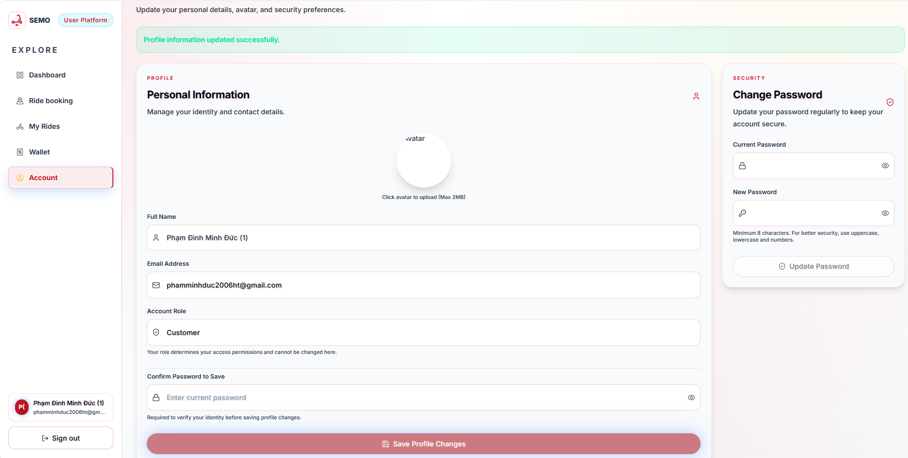

---

* **SEMO-USR-11: Hiển thị lỗi khi Đổi mật khẩu sai quy chuẩn bảo mật**
    * **Tiền điều kiện:** Đang ở màn hình cấu hình Account Settings.
    * **Các bước kiểm thử:**
        1. Tại mục *Change Password* bên phải, nhập mật khẩu hiện tại vào ô "Current Password".
        2. Tại ô "New Password", cố tình gõ một mật khẩu ngắn hoặc không đúng định dạng (Ví dụ: chỉ gõ chữ thường `123`).
        3. Thao tác bấm nút **Update Password**.
    * **Kết quả mong đợi:** Hệ thống chặn lại không gửi request đổi mật khẩu lên server. Giao diện hiển thị dòng nhắc nhở định dạng màu đỏ ngay dưới ô nhập: "Minimum 8 characters. For better security, use uppercase, lowercase and numbers." để cảnh báo người dùng.
      * **Hình ảnh minh chứng thực tế:**

        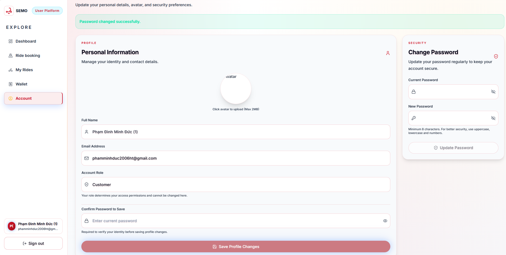
---

### 1.7. Tiêu chí chấp nhận (Acceptance Criteria)
Một hạng mục trong Sprint 1 chỉ được phép merge vào main khi thỏa các điều kiện sau:
* 100% các kịch bản kiểm thử trọng yếu của Auth, Quản lý xe, Nạp tiền VietQR và Feedback hành trình đã được thực thi đầy đủ trên môi trường deploy.
* Không còn tồn đọng lỗi Blocker hoặc Critical liên quan đến luồng đăng ký, đăng nhập và tính toán dòng tiền thanh toán.
* Frontend unit test pass hoàn toàn trong Vitest; Backend unit test pass hoàn toàn trong JUnit.
* **Tỉ lệ pass bắt buộc:** 100% với kịch bản trọng yếu và đạt ít nhất **>= 95%** tổng số test suite của Sprint 1 (các trường hợp lỗi giao diện nhẹ đã được Đức ghi nhận gửi dev sửa).
* **Ngưỡng coverage mã nguồn tối thiểu:**
    * Backend (Java): Line >= 80%, Branch >= 70%.
    * Frontend (React): Line >= 70% cho các module thuộc phạm vi Sprint 1.
* Mọi pull request bắt buộc phải vượt qua toàn bộ job kiểm thử tự động của CI pipeline mới được quyền merge.
---

## 2. Sprint 2

### 2.1. Thông tin tài liệu

### 2.2. Mục tiêu kiểm thử

### 2.3. Phạm vi kiểm thử

### 2.4. Chiến lược kiểm thử

### 2.5. Công cụ kiểm thử

### 2.6. Test Cases quan trọng

### 2.7. Tiêu chí chấp nhận

## 3. Sprint 3

### 3.1. Thông tin tài liệu

### 3.2. Mục tiêu kiểm thử

### 3.3. Phạm vi kiểm thử

### 3.4. Chiến lược kiểm thử

### 3.5. Công cụ kiểm thử

### 3.6. Test Cases quan trọng

### 3.7. Tiêu chí chấp nhận

