# Hướng dẫn sử dụng SEMO dành cho Admin

Tài liệu này mô tả cách quản trị viên (Admin) thao tác với toàn bộ tính năng quản lý của nền tảng SEMO — Smart E-Mobility.

## 1. Mục tiêu

Sau khi đọc hướng dẫn này, Admin có thể:

- Đăng nhập bằng tài khoản Admin và điều hướng console quản trị.
- Quản lý người dùng: xem, tạo mới, khoá/mở khoá tài khoản và reset mật khẩu.
- Quản lý đội xe scooter: thêm xe trên bản đồ, chỉnh sửa thông tin và theo dõi trạng thái.
- Quản lý và theo dõi các chuyến thuê xe (Rentals).
- Xét duyệt giao dịch nạp tiền (Transactions).
- Ghi nhận và xử lý nhật ký bảo trì (Maintenance).
- Lên lịch và hoàn tất sạc pin xe (Charging).
- Tạo và quản lý vùng địa lý (Geofence).
- Xem phản hồi của khách hàng (Feedbacks).
- Phân tích hiệu suất fleet và tính toán vị trí trạm sạc tối ưu (Analytics).
- Cấu hình các tham số hệ thống toàn cục (Settings).

## 2. Đăng nhập Admin

### 2.1. Thông tin đăng nhập mặc định

| Trường | Giá trị |
|--------|---------|
| Email | `admin@semo.com` |
| Password | `Admin@123` |

### 2.2. Các bước đăng nhập

1. Truy cập trang `/login`.
2. Nhập email và mật khẩu Admin.
3. Nhấn **Log in**.
4. Hệ thống nhận diện vai trò ADMIN và chuyển đến **Admin Console**.

Sidebar của Admin hiển thị đầy đủ các mục quản trị: Users, Scooters, Rentals, Transactions, Maintenance, Charging, Geofence, Feedbacks, Analytics, Settings.

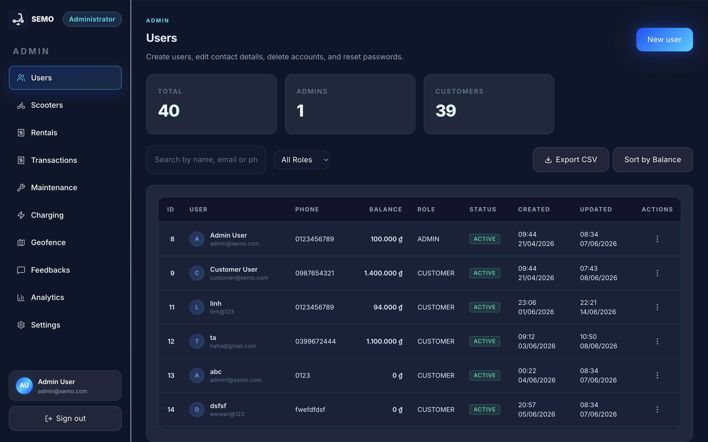

## 3. Users — Quản lý người dùng

### 3.1. Xem danh sách người dùng

1. Mở mục **Users** từ sidebar.
2. Bảng hiển thị toàn bộ người dùng trong hệ thống với các cột: ID, Tên, Email, Số điện thoại, Vai trò, Trạng thái, Số dư ví, Ngày tạo.

### 3.2. Tạo người dùng mới

1. Nhấn nút **New User**.
2. Điền thông tin: Full Name, Email, Password, Phone Number.
3. Nhấn **Save**.

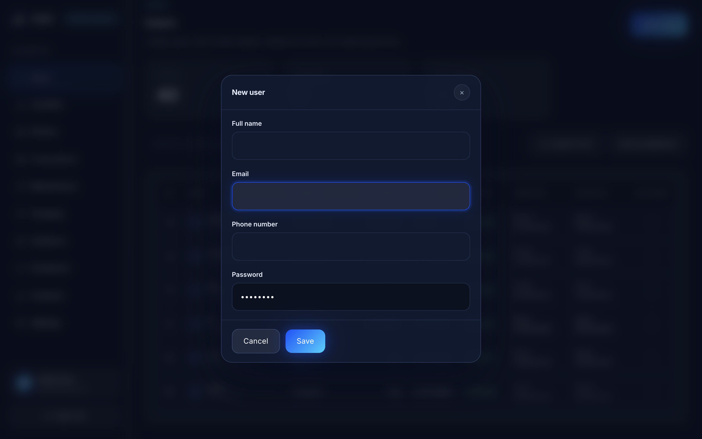

### 3.3. Chỉnh sửa người dùng

1. Nhấn biểu tượng menu (⋮) trên dòng người dùng cần chỉnh sửa.
2. Chọn **Edit**.
3. Cập nhật thông tin và nhấn **Save**.

### 3.4. Khoá / Mở khoá tài khoản

1. Nhấn biểu tượng menu (⋮) trên dòng người dùng.
2. Chọn **Toggle Status**.
3. Tài khoản chuyển giữa trạng thái Active và Inactive.

Người dùng bị khoá không thể đăng nhập hệ thống.

### 3.5. Reset mật khẩu

1. Nhấn biểu tượng menu (⋮) trên dòng người dùng.
2. Chọn **Reset Password**.
3. Xác nhận hành động. Hệ thống tạo mật khẩu mới và trả về cho Admin.

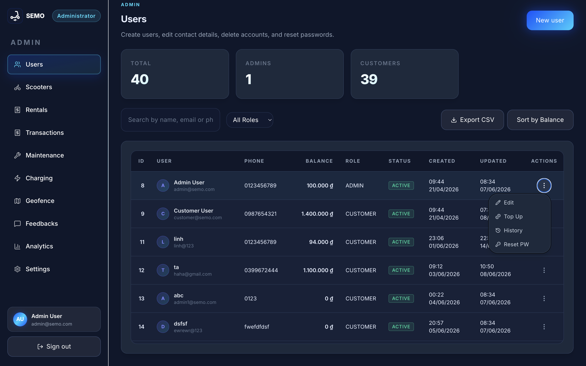

## 4. Scooters — Quản lý xe scooter

### 4.1. Tổng quan fleet

Đầu trang Scooters hiển thị 5 thẻ tóm tắt:
- **Total Fleet**: Tổng số xe trong hệ thống.
- **Available**: Số xe đang sẵn sàng.
- **In Use**: Số xe đang được thuê.
- **Maintenance**: Số xe đang bảo trì.
- **Charging**: Số xe đang sạc.

Dữ liệu tự động làm mới mỗi 5 giây.

### 4.2. Thêm xe mới bằng bản đồ

1. Trên bản đồ ở trang Scooters, nhấn vào vị trí muốn đặt xe.
2. Form **New Scooter** tự động mở, toạ độ Latitude/Longitude được điền sẵn.
3. Điền **Scooter Name** và **Battery Level**.
4. Chọn **Status** (mặc định: Available).
5. Nhấn **Save**.

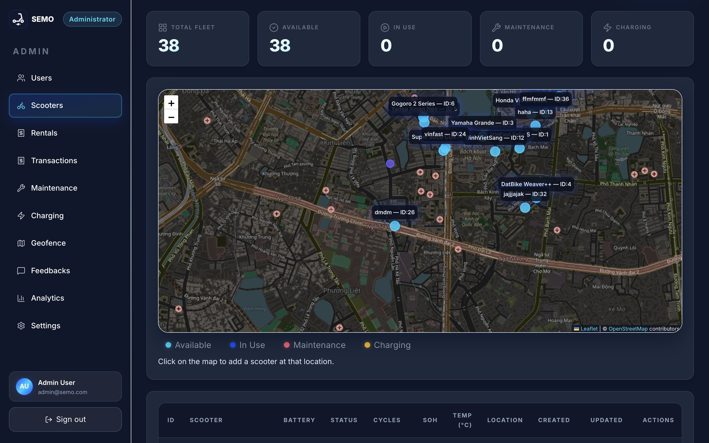

### 4.3. Thêm xe mới thủ công

1. Nhấn nút **New Scooter**.
2. Điền đầy đủ: Tên xe, Mức pin, Latitude, Longitude, Trạng thái.
3. Nhấn **Save**.

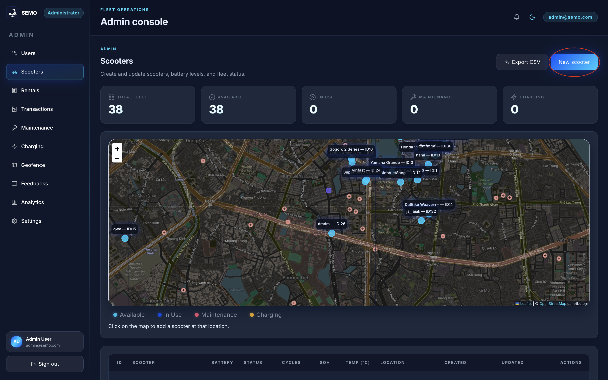

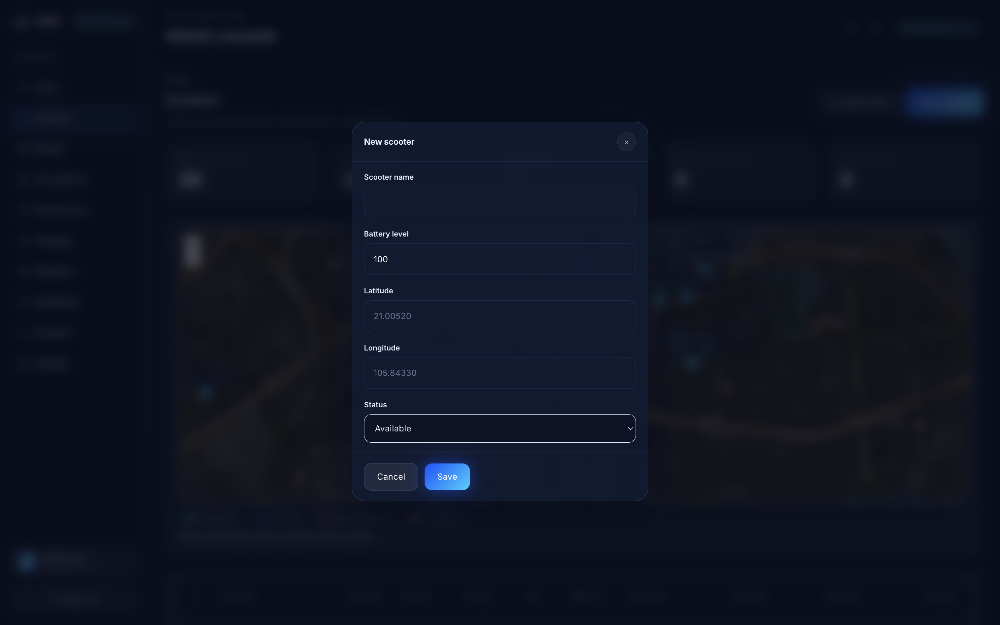

### 4.4. Chỉnh sửa xe

1. Nhấn biểu tượng menu (⋮) trên dòng xe.
2. Chọn **Edit**.
3. Cập nhật thông tin và nhấn **Save**.

### 4.5. Đọc thông tin xe trong bảng

Mỗi xe hiển thị: ID, Tên, Pin (%), Trạng thái, Cycle Count, State of Health (SOH), Nhiệt độ pin (°C), Toạ độ, Ngày tạo/cập nhật.

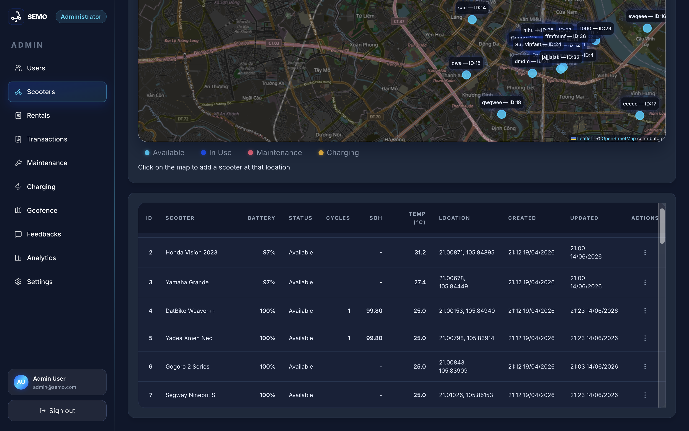

## 5. Rentals — Quản lý chuyến thuê

### 5.1. Xem danh sách chuyến thuê

Mở **Rentals** từ sidebar. Bảng hiển thị tất cả chuyến thuê với các thông tin:
- ID chuyến, Tên/Email khách hàng, Tên xe.
- Thời gian bắt đầu và kết thúc.
- Trạng thái (Active / Completed).
- Tổng cước phí.

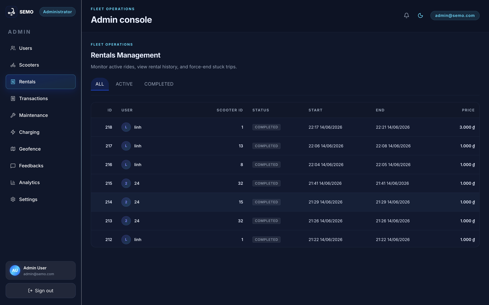

### 5.2. Lọc theo trạng thái

Sử dụng bộ lọc **Status** ở đầu trang để chỉ xem chuyến đang Active hoặc đã Completed.

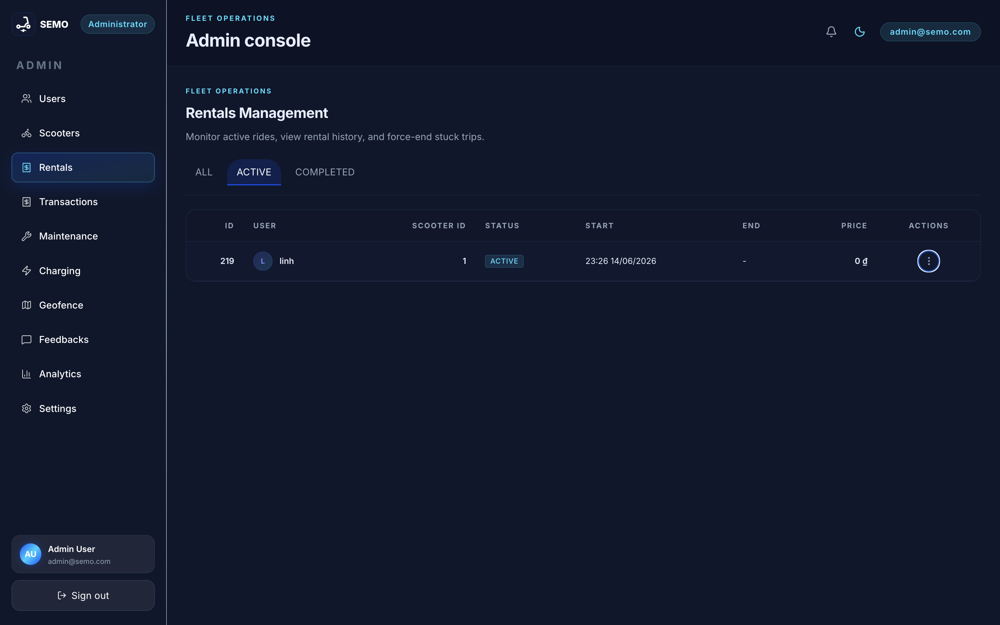

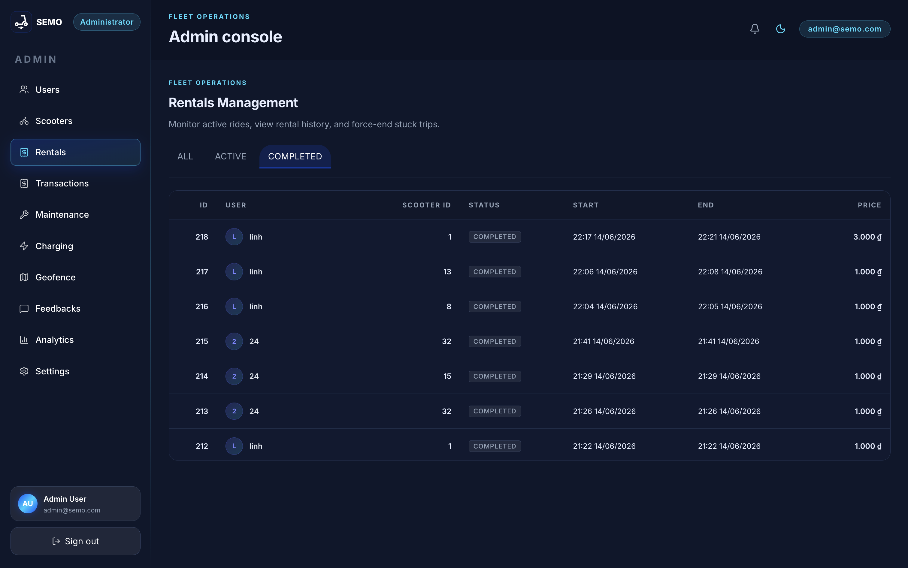

### 5.3. Kết thúc chuyến thuê đang active

Admin có thể kết thúc cưỡng bức một chuyến đang Active:

1. Nhấn biểu tượng menu (⋮) trên dòng chuyến thuê đang Active.
2. Chọn **Force End**.
3. Xác nhận hành động.

Hệ thống tự động tính cước và kết thúc chuyến. Khách hàng đang sử dụng app sẽ nhận thông báo chuyến bị kết thúc.

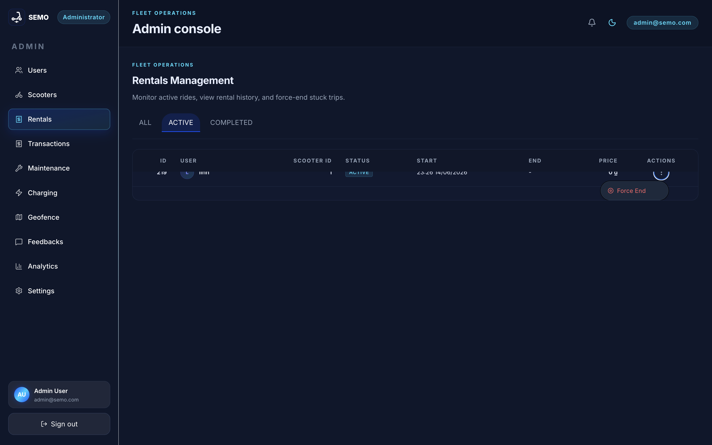

## 6. Transactions — Quản lý giao dịch

### 6.1. Xem danh sách giao dịch

Mở **Transactions** từ sidebar. Bảng hiển thị toàn bộ giao dịch nạp tiền của khách hàng:
- ID, Tên người dùng, Số tiền, Loại, Mô tả, Trạng thái, Ngày tạo.

### 6.2. Phê duyệt giao dịch (Approve)

1. Nhấn biểu tượng menu (⋮) trên dòng giao dịch có trạng thái **Pending**.
2. Chọn **Approve**.
3. Hệ thống cộng số tiền vào ví người dùng và cập nhật trạng thái thành **Approved**.

### 6.3. Từ chối giao dịch (Reject)

1. Nhấn biểu tượng menu (⋮) trên dòng giao dịch **Pending**.
2. Chọn **Reject**.
3. Trạng thái chuyển thành **Rejected**, số tiền không được cộng vào ví.

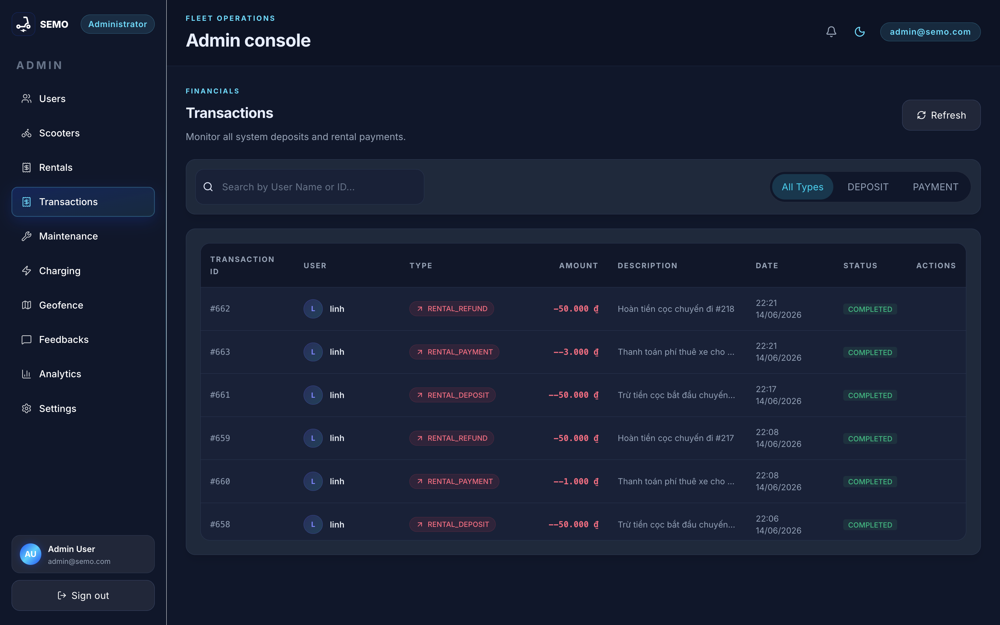

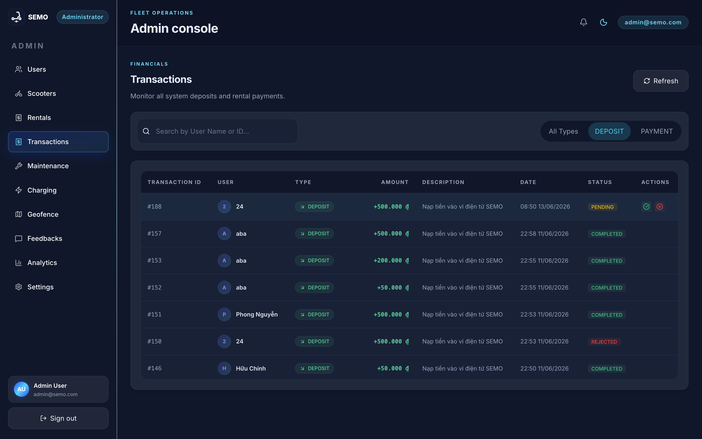

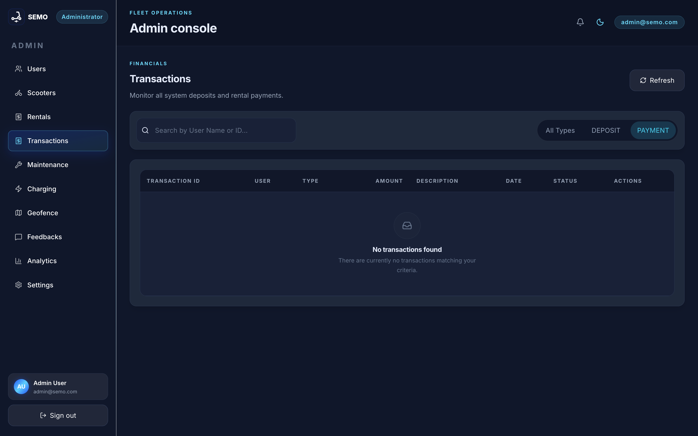

## 7. Maintenance — Nhật ký bảo trì

### 7.1. Xem nhật ký bảo trì

Mở **Maintenance** từ sidebar. Bảng hiển thị toàn bộ nhật ký bảo trì: ID, Tên xe, Lý do, Chi phí, Trạng thái (Pending / Resolved), Ngày tạo.

### 7.2. Tạo nhật ký bảo trì mới

1. Nhấn biểu tượng menu (⋮) trên mỗi dòng, nhấn **Add Log**.
2. Nhập **Reason** mô tả vấn đề, nhập **Chi phí bảo trì** (đơn vị VNĐ).
3. Nhấn **Save**.

Xe liên quan tự động chuyển sang trạng thái **Maintenance**.

### 7.3. Tạo nhật ký bảo trì nhanh

1. Nhấn biểu tượng menu (⋮) trên mỗi dòng, nhấn **Mark Broken**.

Xe liên quan tự động chuyển sang trạng thái **Maintenance**.

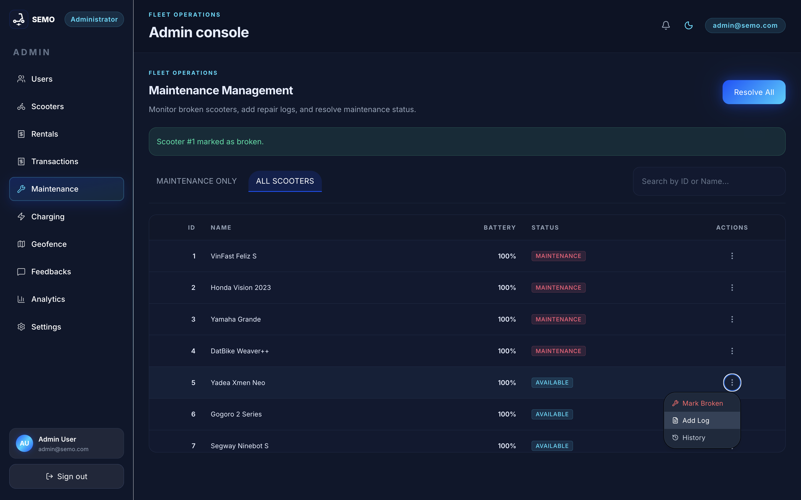

### 7.4. Giải quyết bảo trì (Resolve)

Sau khi sửa chữa xong:

1. Nhấn biểu tượng menu (⋮) trên dòng log cần xử lý.
2. Chọn **Resolve**.

Hệ thống cập nhật log thành Resolved và chuyển xe về trạng thái **Available**.

## 8. Charging — Quản lý sạc pin

### 8.1. Lên lịch sạc tự động

1. Mở **Charging** từ sidebar.
2. Nhấn **Auto Schedule Charging**.
3. Hệ thống tự động xác định các xe có mức pin thấp (dưới ngưỡng `MAINTENANCE_THRESHOLD`) và lên lịch sạc.

### 8.2. Hoàn tất phiên sạc

Sau khi xe đã được sạc đầy pin:

1. Nhấn biểu tượng menu (⋮) trên dòng phiên sạc.
2. Chọn **Complete Charging**.
3. Hệ thống cập nhật trạng thái xe về **Available**.

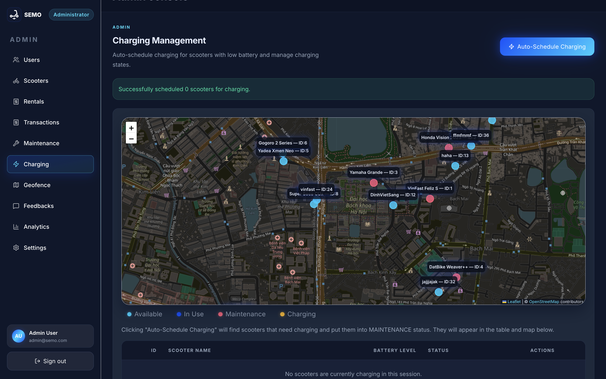

## 9. Geofence — Vùng địa lý

### 9.1. Xem danh sách vùng geofence

Mở **Geofence** từ sidebar. Bản đồ hiển thị các vùng đang hoạt động bằng vòng tròn; bảng bên dưới liệt kê chi tiết: ID, Tên, Toạ độ trung tâm, Bán kính, Trạng thái.

### 9.2. Tạo vùng geofence mới

1. Nhấn vào vị trí trên bản đồ để chọn điểm trung tâm.
2. Form **New Zone** tự động mở với toạ độ được điền sẵn.
3. Điền **Zone Name** và **Radius** (mét).
4. Nhấn **Save**.

Vùng mới xuất hiện trên bản đồ ngay lập tức.

### 9.3. Chỉnh sửa và xoá vùng

- **Chỉnh sửa**: Nhấn menu (⋮) → **Edit** để cập nhật tên, bán kính hoặc trạng thái (Active/Inactive).
- **Xoá**: Nhấn menu (⋮) → **Delete** để xoá vùng vĩnh viễn.

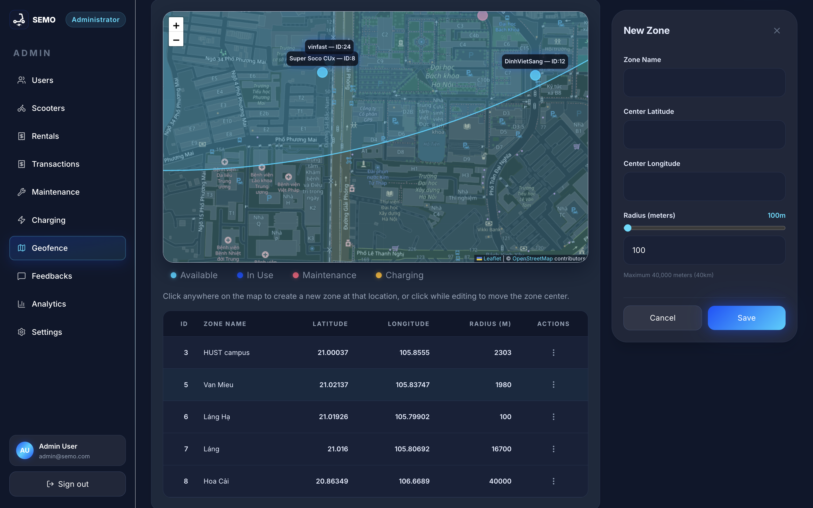

## 10. Feedbacks — Xem phản hồi khách hàng

### 10.1. Xem danh sách phản hồi

Mở **Feedbacks** từ sidebar. Bảng hiển thị toàn bộ phản hồi của khách hàng:
- ID, Tên người dùng, ID chuyến thuê, Đánh giá (sao), Bình luận, Ngày gửi.

Sử dụng phần này để theo dõi chất lượng dịch vụ và nhận diện các vấn đề thường gặp.

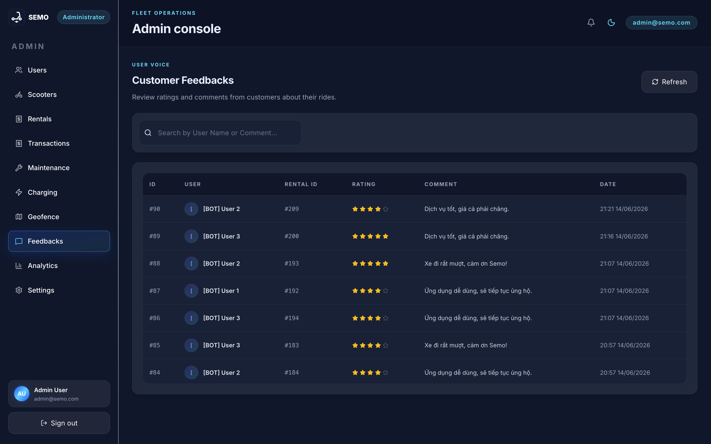

## 11. Analytics — Phân tích và tối ưu

### 11.1. Thẻ KPI tổng quan

Đầu trang Analytics hiển thị 4 thẻ chỉ số chính:
- **Total Revenue**: Tổng doanh thu (VNĐ).
- **Total Rides**: Tổng số chuyến đã hoàn thành.
- **Fleet Available**: Tỉ lệ xe đang sẵn sàng.
- **Maintenance Costs**: Tổng chi phí bảo trì.

### 11.2. Tính toán vị trí trạm sạc tối ưu

Hệ thống hỗ trợ hai thuật toán phân cụm để xác định vị trí tối ưu cho các trạm sạc mới:

**Thuật toán K-Means (Fixed K):**
1. Chọn **K-Means** trong dropdown **Algorithm**.
2. Nhập **Number of stations (k)** — số lượng trạm cần đặt.
3. Nhấn **Calculate**.

**Thuật toán HDBSCAN (Density-based):**
1. Chọn **HDBSCAN** trong dropdown **Algorithm**.
2. Nhập **Minimum Cluster Size** — số xe tối thiểu để tạo một cụm.
3. Nhấn **Calculate**.

Sau khi tính toán:
- Các trạm đề xuất hiển thị trên bản đồ dưới dạng điểm màu Cyan.
- Xe scooter được tô màu theo cụm gần nhất.
- Toạ độ (Latitude, Longitude) của từng trạm đề xuất hiển thị trong bảng bên dưới.

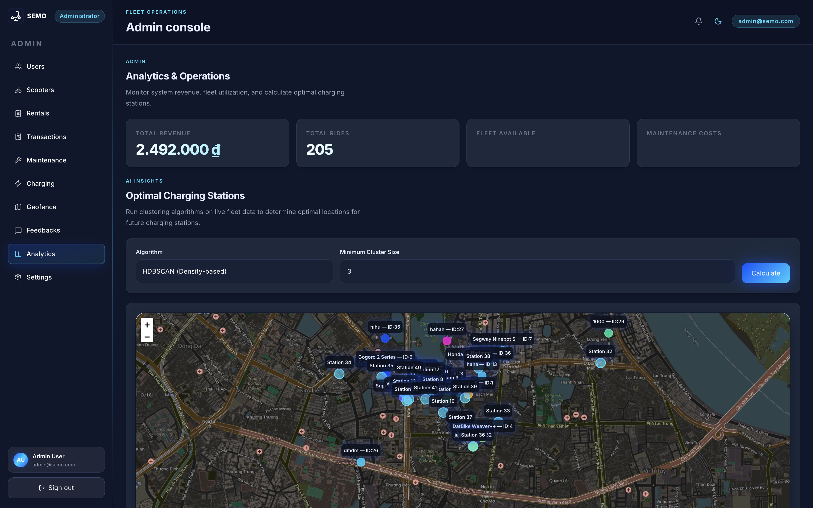

## 12. Settings — Cấu hình hệ thống

### 12.1. Xem cấu hình hiện tại

Mở **Settings** từ sidebar. Bảng hiển thị các tham số hệ thống:

| Key | Mô tả | Giá trị mặc định |
|-----|-------|-----------------|
| `BASE_PRICE` | Giá thuê mỗi phút (VNĐ) | 5.000 |
| `UNLOCK_FEE` | Phí mở khóa xe (VNĐ) | 10.000 |
| `MIN_BALANCE` | Số dư ví tối thiểu (VNĐ) | 20.000 |
| `MAINTENANCE_THRESHOLD` | Ngưỡng pin tự động bảo trì (%) | 20 |
| `DISCOUNT_RATE` | Tỉ lệ giảm giá (0.1 = 10%) | 0 |

### 12.2. Chỉnh sửa cấu hình

1. Nhấn biểu tượng menu (⋮) → **Edit** trên dòng config muốn chỉnh sửa.
2. Cập nhật **Value** và **Description**.
3. Nhấn **Save Config**.

Với các config chưa được thiết lập trong database (hiển thị chú thích *Chưa thiết lập*), hành động Save sẽ tạo mới bản ghi trong database.

### 12.3. Tạo cấu hình mới

1. Nhấn **New Config**.
2. Điền **Key** (dạng UPPER_SNAKE_CASE), **Value** và **Description**.
3. Nhấn **Save Config**.

### 12.4. Xoá cấu hình

Chỉ có thể xoá các config tuỳ chỉnh (không phải config mặc định):

1. Nhấn biểu tượng menu (⋮) → **Delete** trên dòng config.
2. Xác nhận xoá.

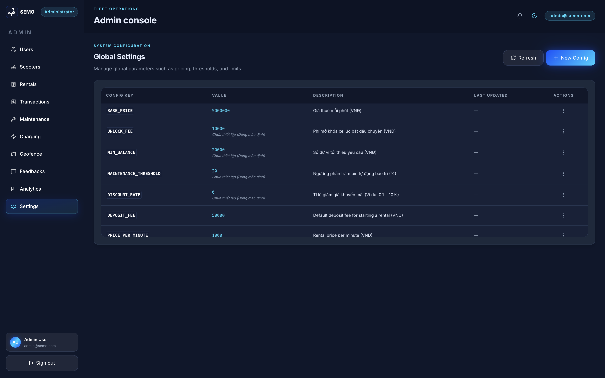

## 13. Quy trình sử dụng nhanh cho Admin

Nếu bạn muốn thao tác nhanh sau khi đăng nhập, hãy làm theo trình tự sau:

1. Vào **Settings** để kiểm tra và cập nhật giá cước, phí mở khoá.
2. Vào **Scooters** để thêm xe mới lên bản đồ và kiểm tra trạng thái fleet.
3. Vào **Users** để quản lý tài khoản người dùng mới đăng ký.
4. Vào **Transactions** để phê duyệt hoặc từ chối các giao dịch nạp tiền đang Pending.
5. Vào **Rentals** để theo dõi các chuyến đi đang Active.
6. Vào **Maintenance** để xử lý các xe đang bảo trì.
7. Vào **Charging** để lên lịch sạc cho xe pin thấp.
8. Vào **Feedbacks** để đọc phản hồi từ khách hàng.
9. Vào **Analytics** để xem KPI và chạy phân tích trạm sạc.

## 14. Kết luận

Admin Console của SEMO cung cấp toàn bộ công cụ để vận hành một đội fleet xe scooter điện:

- Quản lý đội xe và theo dõi trạng thái real-time trên bản đồ.
- Xét duyệt tài khoản người dùng và giao dịch tài chính.
- Xử lý bảo trì và sạc pin đội xe.
- Cấu hình linh hoạt các tham số giá cước và vận hành.
- Phân tích dữ liệu và tối ưu hạ tầng trạm sạc bằng thuật toán AI.
