# Hướng dẫn sử dụng SEMO dành cho Customer

Tài liệu này mô tả cách người dùng thông thường (Customer) thao tác với các tính năng của nền tảng SEMO — Smart E-Mobility.

## 1. Mục tiêu

Sau khi đọc hướng dẫn này, người dùng có thể:

- Đăng ký tài khoản và xác thực email bằng OTP.
- Đăng nhập và điều hướng giao diện.
- Xem bản đồ xe và tổng quan đội xe trên trang Dashboard.
- Tìm kiếm, chọn và đặt xe scooter trên bản đồ.
- Thực hiện đầy đủ luồng thuê xe: Book → Unlock → Start → End.
- Xem lịch sử chuyến đi và gửi phản hồi.
- Nạp tiền vào ví và xem lịch sử giao dịch.
- Cập nhật thông tin cá nhân, đổi mật khẩu và tải ảnh đại diện.

## 2. Đăng ký và đăng nhập

### 2.1. Tạo tài khoản mới

1. Truy cập trang đăng ký tại `Create a new account`.
2. Điền các thông tin sau:
   - **Full Name**: Họ và tên đầy đủ.
   - **Email**: Địa chỉ email hợp lệ.
   - **Phone Number**: Số điện thoại (tuỳ chọn).
   - **Password** và **Confirm Password**: Mật khẩu phải có ít nhất 8 ký tự, bao gồm chữ hoa, chữ thường, số và ký tự đặc biệt.
3. Nhấn **Register**.
4. Hệ thống gửi mã OTP 6 chữ số đến email vừa đăng ký.
5. Nhập OTP vào ô xác thực, nhấn **Verify**.
6. Sau khi xác thực thành công, hệ thống chuyển sang trang **Login**.

Lưu ý:
- Nếu không nhận được OTP, nhấn **Resend OTP** để gửi lại.
- OTP có thời hạn sử dụng giới hạn; nên kiểm tra email ngay sau khi đăng ký.

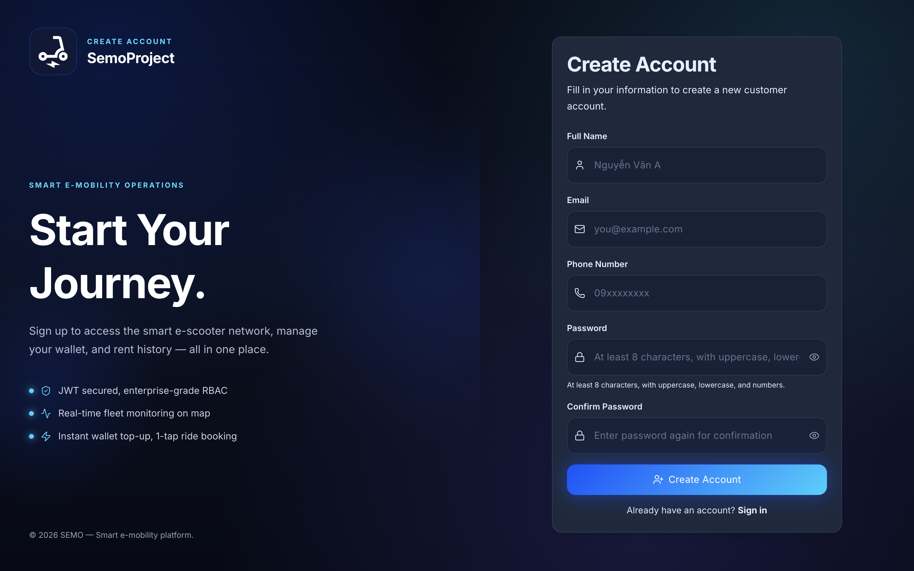

### 2.2. Đăng nhập

1. Truy cập trang đăng nhập tại `/login`.
2. Nhập **Email** và **Password** đã đăng ký.
3. Nhấn **Log in**.
4. Nếu thông tin đúng, hệ thống chuyển đến trang **Dashboard**.

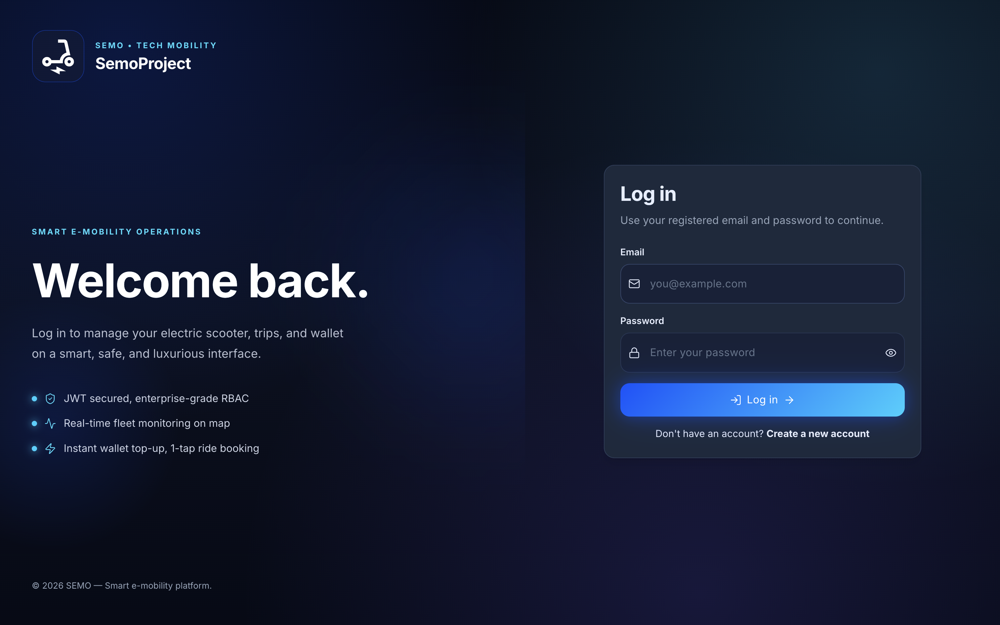

## 3. Dashboard — Tổng quan đội xe

### 3.1. Thông tin hiển thị

Sau khi đăng nhập, trang **Dashboard** hiển thị:

- **Bản đồ scooter**: Vị trí thực của toàn bộ xe trong đội fleet, được phân biệt bằng màu sắc:
  - 🔵 **Cyan**: Xe đang sẵn sàng (Available).
  - 🔵 **Blue**: Xe đang được thuê (In Use).
  - 🔴 **Đỏ**: Xe đang bảo trì (Maintenance).
  - 🟡 **Vàng**: Xe đang sạc (Charging).
- **Bảng tóm tắt fleet**: Số lượng xe theo từng trạng thái.

### 3.2. Làm mới dữ liệu

Nhấn nút **Refresh Data** (biểu tượng vòng tròn) để tải lại danh sách xe mới nhất từ server.

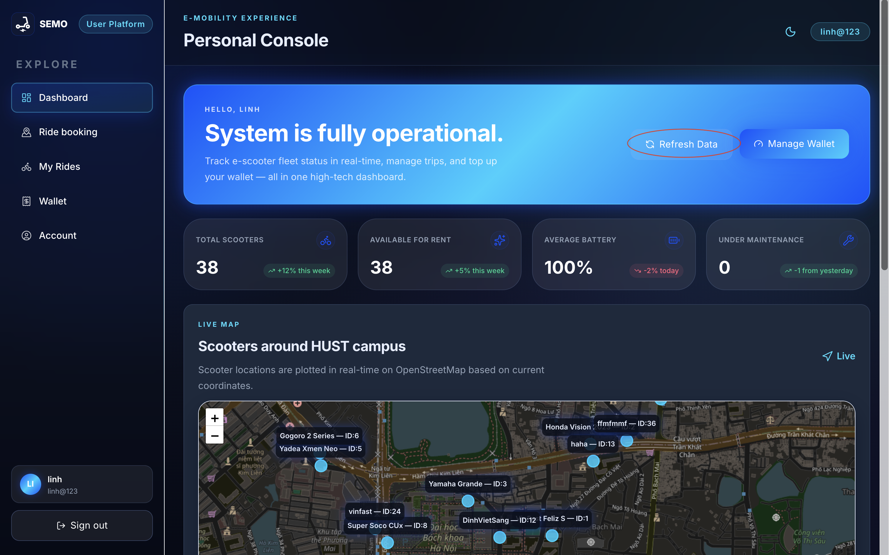

## 4. Đặt xe — Ride Booking

### 4.1. Truy cập trang đặt xe

Mở trang **Ride Booking** từ menu bên trái.
Giao diện chia thành hai phần:
- **Bản đồ** (bên trái): Hiển thị vị trí xe và vị trí của bạn.
- **Control Panel** (bên phải): Bộ lọc, thông tin xe và các nút hành động.

### 4.2. Cho phép truy cập vị trí

Lần đầu mở trang, trình duyệt yêu cầu quyền truy cập vị trí. Hãy nhấn **Allow** để hệ thống:

- Hiển thị vị trí của bạn (chấm tròn màu xanh trên bản đồ).
- Lọc xe trong bán kính mặc định 1,5 km.
- Tính khoảng cách từ bạn đến từng xe.

Nếu từ chối, bản đồ vẫn hoạt động nhưng không hiển thị vị trí cá nhân và không lọc theo bán kính.

### 4.3. Tìm và lọc xe

Sử dụng bộ lọc trong Control Panel để thu hẹp danh sách xe:

- **Search**: Nhập tên xe hoặc mã ID để tìm kiếm.
- **Status Filter**: Lọc theo trạng thái (All / Available / In Use / Maintenance).
- **Radius Filter**: Bật/tắt lọc theo bán kính và điều chỉnh khoảng cách tối đa.

Xe được sắp xếp ưu tiên: Available trước, sau đó theo khoảng cách gần nhất.

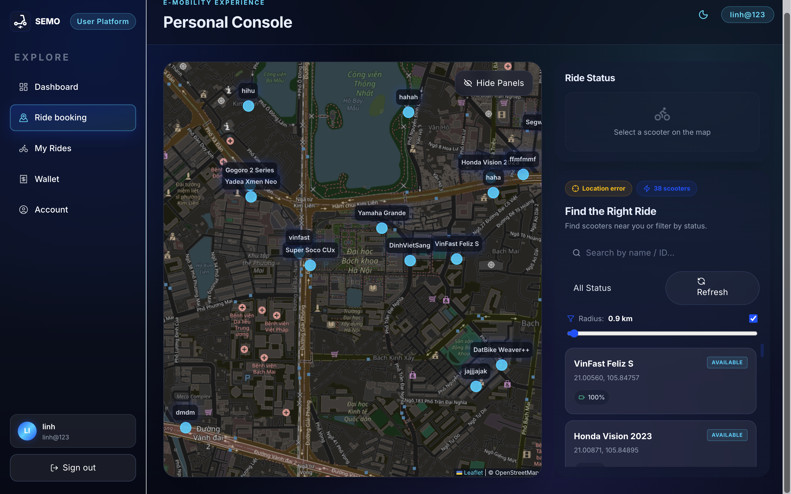

### 4.4. Chọn xe trên bản đồ

1. Nhấn vào biểu tượng xe trên bản đồ để chọn.
2. Control Panel cập nhật thông tin xe đã chọn:
   - Tên xe và ID.
   - Mức pin (Battery).
   - Khoảng cách đường đi thực tế đến xe (Route).
3. Đường dẫn (route) từ vị trí của bạn đến xe được vẽ trên bản đồ bằng đường chấm xanh.

Chỉ có thể chọn xe ở trạng thái **Available**.

### 4.5. Luồng thuê xe

#### Bước 1 — Book (Giữ chỗ)

Sau khi chọn xe, nhấn **Book** để giữ chỗ. Xe chuyển sang trạng thái đã được đặt.

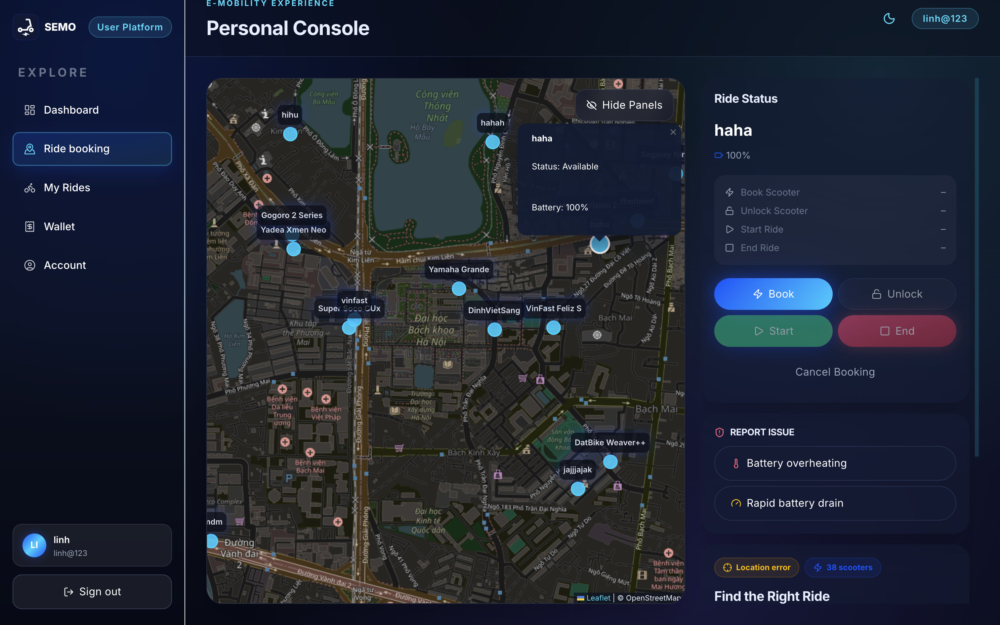

#### Bước 2 — Unlock (Mở khóa)

Nhấn **Unlock** để xác nhận bạn đã đến nơi và sẵn sàng mở khóa xe.

#### Bước 3 — Start Ride (Bắt đầu đi)

Nhấn **Start Ride** để chính thức bắt đầu chuyến đi. Hệ thống:
- Ghi lại thời gian bắt đầu.
- Đồng hồ đếm giờ hiện lên trong Control Panel.
- Tính cước phí theo thời gian thực.

#### Bước 4 — End Ride (Kết thúc chuyến)

Nhấn **End Ride** khi bạn đến nơi. Hệ thống hiển thị:
- Tổng thời gian chuyến đi.
- **Tổng cước phí** cần thanh toán.
Số tiền được trừ trực tiếp từ ví của bạn.

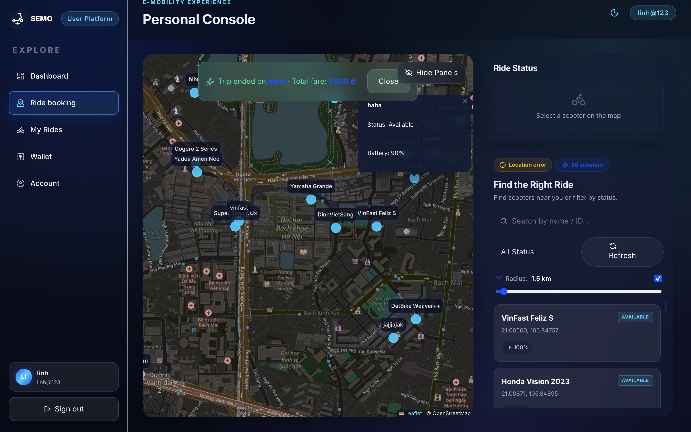

### 4.6. Báo cáo sự cố

Trong quá trình đi xe, nếu gặp sự cố (pin quá nóng, xe hỏng, v.v.), nhấn nút **Report Issue** trong Control Panel. Hệ thống sẽ:
- Đánh dấu xe là cần bảo trì.
- Tự động kết thúc chuyến đi hiện tại nếu đang riding.

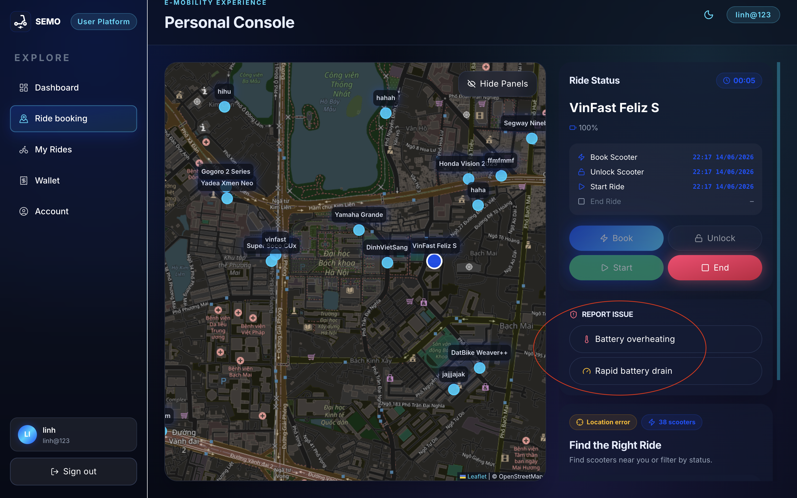

### 4.7. Ẩn/hiện Control Panel

Nhấn nút **Hide Panels / Show Panels** ở góc trên bên phải bản đồ để ẩn hoặc hiện bảng điều khiển, giúp xem bản đồ toàn màn hình.

## 5. My Rides — Lịch sử chuyến đi

### 5.1. Truy cập lịch sử

Mở **My Rides** từ menu bên trái.

### 5.2. Thông tin hiển thị

Trang My Rides bao gồm:

- **Total Completed Rides**: Tổng số chuyến đã hoàn thành.
- **Total Spent**: Tổng số tiền đã chi tiêu.
- **Danh sách chuyến đi**: Mỗi thẻ hiển thị:
  - Tên xe và ID.
  - Thời gian bắt đầu và kết thúc.
  - Trạng thái (Active / Completed).
  - Tổng cước phí.

### 5.3. Gửi phản hồi (Feedback)

Với các chuyến đi đã hoàn thành (Completed), bạn có thể gửi phản hồi:

1. Nhấn nút **Feedback** trên thẻ chuyến đi.
2. Chọn **Rating** từ 1 đến 5 sao.
3. Nhập **Comment** tuỳ chọn.
4. Nhấn **Submit Feedback**.

Mỗi chuyến chỉ được gửi phản hồi một lần. Sau khi gửi, nút chuyển thành "Feedback Submitted".

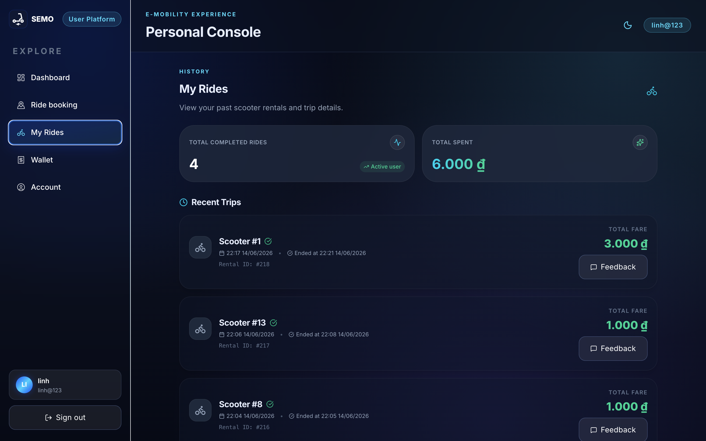

## 6. Wallet — Ví điện tử

### 6.1. Truy cập ví

Mở **Wallet** từ menu bên trái.

### 6.2. Nạp tiền vào ví

1. Trong mục **Deposit**, nhập số tiền muốn nạp (đơn vị VNĐ).
2. Nhấn **Deposit**.
3. Giao dịch tạo ra ở trạng thái **Pending** — chờ Admin xét duyệt.
4. Sau khi Admin phê duyệt, số dư ví được cập nhật tự động.

Lưu ý:
- Số dư ví tối thiểu yêu cầu để bắt đầu chuyến đi là **10.000 VNĐ**.
- Cước phí thuê xe = **Phí mở khóa** + **Giá mỗi phút × số phút**.

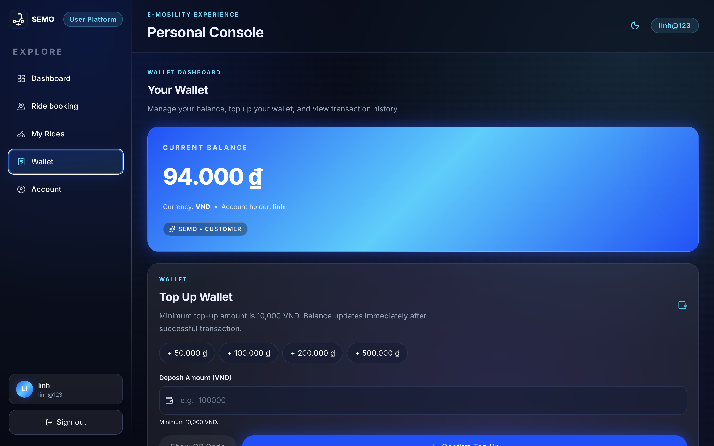

### 6.3. Xem lịch sử giao dịch

Trang Wallet hiển thị toàn bộ lịch sử giao dịch, bao gồm:
- Ngày giờ giao dịch.
- Loại giao dịch (Nạp tiền / Thanh toán chuyến đi).
- Số tiền.
- Trạng thái (Pending / Approved / Rejected).

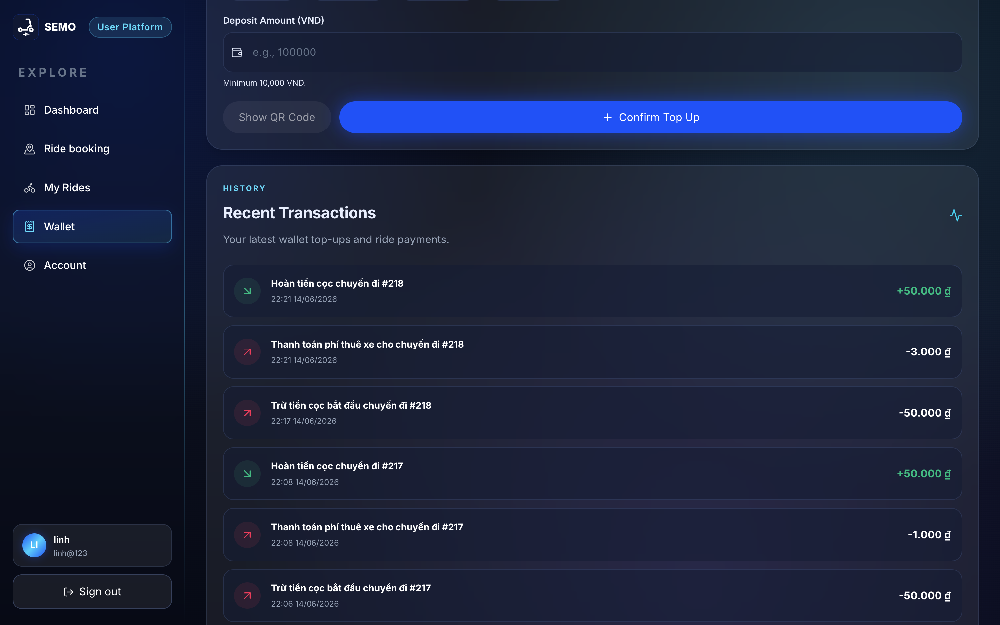

## 7. Account — Tài khoản cá nhân

### 7.1. Truy cập tài khoản

Mở **Account** từ menu bên trái.

### 7.2. Cập nhật thông tin cá nhân

1. Chỉnh sửa **Full Name**, **Email** hoặc **Phone Number**.
2. Nhấn **Save Changes**.

### 7.3. Đổi mật khẩu

1. Nhập **Current Password** (mật khẩu hiện tại).
2. Nhập **New Password** và **Confirm New Password**.
3. Nhấn **Change Password**.

Mật khẩu mới phải đáp ứng yêu cầu độ mạnh: ít nhất 8 ký tự, có chữ hoa, chữ thường, số và ký tự đặc biệt.

### 7.4. Tải ảnh đại diện

1. Nhấn vào vùng ảnh đại diện hoặc nút **Upload Avatar**.
2. Chọn file ảnh từ máy tính.
3. Ảnh được tải lên và cập nhật ngay lập tức.

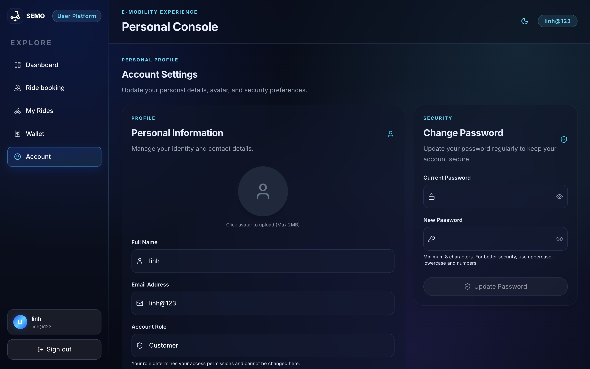

## 8. Đổi giao diện (Theme)

SEMO hỗ trợ nhiều chủ đề giao diện. Nhấn nút chuyển theme ở góc trên cùng bên phải để thay đổi giữa các chủ đề:

- **SEMO** (mặc định): Nền tối, màu Cyan/Blue.
- **HUST**: Nền sáng, màu đỏ và vàng.

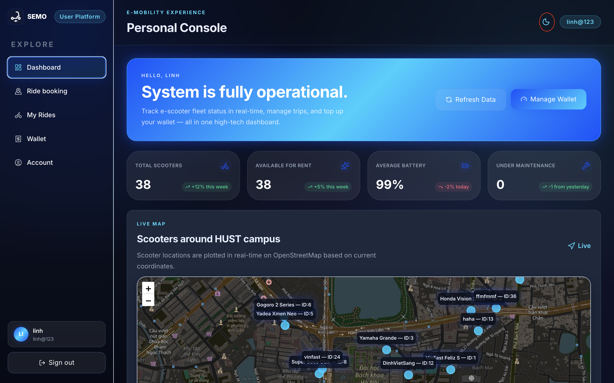

## 9. Quy trình sử dụng nhanh cho người mới

Nếu bạn muốn thao tác nhanh, hãy làm theo trình tự sau:

1. Đăng ký tài khoản và xác thực email bằng OTP.
2. Đăng nhập, vào trang **Wallet** và nạp tiền vào ví.
3. Chờ Admin phê duyệt giao dịch (số dư được cập nhật sau khi được duyệt).
4. Mở **Ride Booking**, cho phép truy cập vị trí.
5. Tìm và nhấn chọn xe **Available** trên bản đồ.
6. Thực hiện theo luồng: **Reserve → Unlock → Start Ride**.
7. Sau khi đến đích, nhấn **End Ride** để kết thúc chuyến.
8. Xem chi phí chuyến đi trong **My Rides**.
9. Gửi **Feedback** để đánh giá chất lượng dịch vụ.

## 10. Kết luận

Nền tảng SEMO cung cấp đầy đủ luồng cho người dùng Customer:

- Đăng ký và xác thực tài khoản an toàn bằng OTP.
- Đặt và quản lý chuyến đi xe scooter trực tiếp trên bản đồ.
- Nạp tiền và theo dõi số dư ví điện tử.
- Xem lịch sử chuyến đi và gửi phản hồi dịch vụ.
- Quản lý thông tin tài khoản cá nhân dễ dàng.
